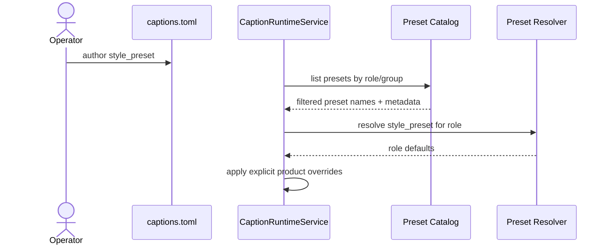

# Caption Preset Group And Role Catalog Workflow 2026-06-19

This document is the SSOT for grouping caption style presets by caption purpose and filtering them by role.

It complements [43_Product_Caption_Pool_And_Font_Workflow_2026-06-14.md](/F:/programming/python/MTClipFactory/doc/43_Product_Caption_Pool_And_Font_Workflow_2026-06-14.md), [55_Caption_Style_Preset_Workflow_2026-06-15.md](/F:/programming/python/MTClipFactory/doc/55_Caption_Style_Preset_Workflow_2026-06-15.md), and [64_Manual_Break_Compaction_And_Face_Safe_Headline_Workflow_2026-06-19.md](/F:/programming/python/MTClipFactory/doc/64_Manual_Break_Compaction_And_Face_Safe_Headline_Workflow_2026-06-19.md).

## Purpose

- stop the preset catalog from becoming a flat unreadable list
- help operators choose presets by caption job, not by guessing style names
- protect `sub` readability with dedicated lower-third focused presets
- create a catalog seam that future UI controls can filter by role and preset group

## Core Decision

- presets are now classified into named `preset groups`
- a preset may define one or many supported roles
- runtime resolution still happens by `style_preset + role`
- catalogs should expose group and role metadata before a UI picker exists
- the initial baseline should stay intentionally small even though the system can grow later

## Initial Group Baseline

Recommended working baseline:

1. `headline_main`
2. `support_sub`
3. `proof_info`

Recommended shipped count for this stage:

- keep the active built-in catalog small and intentional
- grow toward `6-8 presets` only when real operator use justifies it
- do not inflate the catalog with near-duplicate names that create choice paralysis

## Initial Built-In Catalog

### `headline_main`

- `sale_blast`

Use when the clip needs a high-attention promo headline card.

### `support_sub`

- `clean_cta`
- `dark_lower_third`

Use when the clip needs readable support copy or a stable lower-third.

`dark_lower_third` exists specifically for cases where bottom support captions disappear into busy visuals or bright backgrounds.

### `proof_info`

- `benefit_stack`

Use when the clip needs benefit phrasing, proof rhythm, or a more structured information stack.

## Operator Rule

- choose group first
- then choose preset within that group
- then override only the fields that are truly product-specific

That means:

- `main` hooks should usually start inside `headline_main`
- `sub` support copy should usually start inside `support_sub`
- proof, ingredients, and structured message stacks should usually start inside `proof_info`

## Sequence

## Acceptance Criteria

- the preset catalog can be listed by group
- the preset catalog can be filtered by role
- `sub` readability can be improved by choosing a support-specific preset instead of overloading headline presets
- runtime continues to fail truthfully when a preset does not define the requested role
