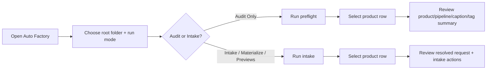
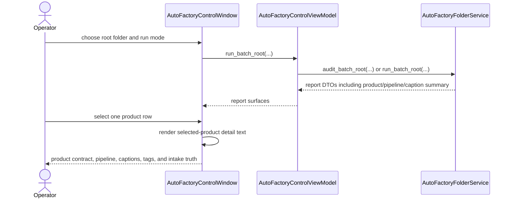

# Auto Factory Product Contract Review Surface 2026-06-19

This document is the SSOT for the next operator-facing detail surface inside the desktop `Auto Factory` screen.

It extends [37_Auto_Factory_Control_Surface_Workflow_2026-06-13.md](/F:/programming/python/MTClipFactory/doc/37_Auto_Factory_Control_Surface_Workflow_2026-06-13.md), [43_Product_Caption_Pool_And_Font_Workflow_2026-06-14.md](/F:/programming/python/MTClipFactory/doc/43_Product_Caption_Pool_And_Font_Workflow_2026-06-14.md), [63_Auto_Factory_Operations_Control_Requirements_2026-06-19.md](/F:/programming/python/MTClipFactory/doc/63_Auto_Factory_Operations_Control_Requirements_2026-06-19.md), and [65_Caption_Preset_Group_And_Role_Catalog_Workflow_2026-06-19.md](/F:/programming/python/MTClipFactory/doc/65_Caption_Preset_Group_And_Role_Catalog_Workflow_2026-06-19.md).

## Purpose

- let operators inspect the product-folder contract truth that the engine will actually use
- reduce context switching between the desktop UI and raw `product.toml` / `pipeline.toml` / `captions.toml` files
- expose caption intent early enough that operators can spot wrong preset/font/tag combinations before a live run
- keep the control surface aligned with the newer product-local `runs/<batch_code>` and caption-preset workflow

## Problem Statement

The first `Auto Factory` screen could launch work and report high-level outcomes, but it still left an operator guessing:

1. what pipeline duration rule will be used for this product
2. which selection tags are narrowing the asset pools
3. whether the product has a meaningful caption contract at all
4. which caption preset and font the product intends to use
5. whether the tag metadata inside each asset folder is sufficient before pressing `Run`

That gap creates avoidable trial-and-error, especially when operators are working from external product folders instead of engineering-owned sample data.

## Core Decision

- the `Auto Factory` window should gain one read-only selected-product detail panel
- the panel should update from the currently selected row in either the audit table or the intake table
- the panel should show contract truth, not inferred marketing guesses
- the panel should prefer concise summaries over raw TOML dumps
- the panel should remain read-only in this slice; authoring/editing stays in product-folder files or later dedicated editors

## Required Summary Blocks

When the selected product is coming from `Audit Only`, the panel should summarize:

- product contract fields such as product code, product name, brand, category, and default platform
- pipeline contract fields such as requested outputs, ratio, uniqueness scope, duration mode, fixed/min/max duration, and selection tags
- caption contract fields such as selection mode, seed scope, segment pools, main/sub pool counts, and main/sub preset plus font intent
- asset-folder readiness evidence such as ingestible file counts, tag-file presence, tag counts, required-tag coverage, and blocking issues

When the selected product is coming from `Intake` or later run modes, the panel should summarize:

- the resolved runtime request for that product
- deterministic asset registration/skipped counts
- the concrete asset intake actions recorded for that product
- the reminder that product-local artifacts and journal evidence live under `runs/<batch_code>` when the source product folder is known

## Operator Workflow

## Sequence

## Review Notes

This slice was reviewed before implementation and the following boundaries were locked:

1. the panel must reflect DTO-backed truth from the folder service, not a second parser hidden inside the window
2. the panel should summarize `captions.toml` intent, not render raw caption text pools line by line
3. the panel should help operators validate `style_preset` and font choices now that preset groups exist, even before a dedicated preset-picker UI exists
4. the panel should stay read-only so this slice improves operational clarity without expanding editing risk

## Delivered Slice

- delivered preflight DTO summaries for product contract, pipeline contract, and caption contract intent
- delivered selected-product inspection inside the desktop `Auto Factory` screen for both audit and intake result tables
- delivered run-mode guidance text that explains what each mode will do and reminds operators where product-local run artifacts are written
- delivered pytest coverage for the new contract-summary seam and the upgraded `Auto Factory` window surface

## Acceptance Criteria

- operators can inspect selection tags, duration policy, and caption preset/font intent from the `Auto Factory` window
- audit rows expose enough detail to understand product readiness without opening raw files first
- intake rows expose enough detail to understand what runtime request and asset actions were actually applied
- the UI remains read-only and truthful to service DTO output
