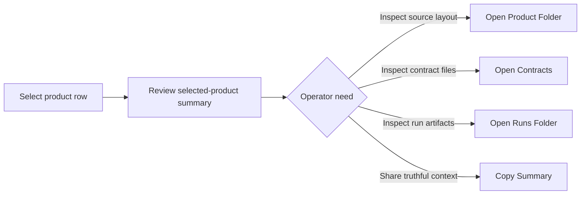
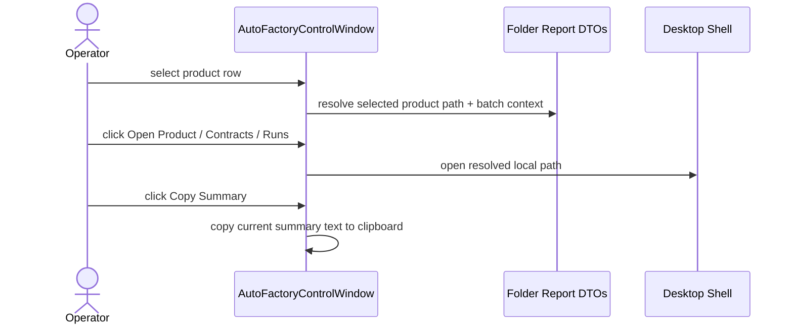

# Auto Factory Review Surface Operator Actions 2026-06-20

This document is the SSOT for the first actionable shortcuts attached to the desktop `Auto Factory` selected-product review surface.

It extends [63_Auto_Factory_Operations_Control_Requirements_2026-06-19.md](/F:/programming/python/MTClipFactory/doc/63_Auto_Factory_Operations_Control_Requirements_2026-06-19.md) and [66_Auto_Factory_Product_Contract_Review_Surface_2026-06-19.md](/F:/programming/python/MTClipFactory/doc/66_Auto_Factory_Product_Contract_Review_Surface_2026-06-19.md).

## Purpose

- reduce operator friction after the review surface already exposes contract/runtime truth
- let operators move directly from review to the correct product-local folder context
- support lightweight handoff by copying one truthful product summary without screenshots or manual retyping

## Problem Statement

The selected-product panel could already explain:

1. product contract truth
2. pipeline duration and tag policy
3. caption preset and font intent
4. runtime request or intake action evidence

But the operator still had to leave the UI manually to locate the product folder, the contracts area, or the relevant `runs/<batch_code>` folder. That slowed down investigation and made the review surface less useful during real troubleshooting.

## Core Decision

- the review surface should stay read-only for authored content
- the review surface may still expose safe navigation and handoff actions
- the first shipped action set should stay intentionally small: `Open Product Folder`, `Open Contracts`, `Open Runs Folder`, and `Copy Summary`
- `Open Product Folder`
- `Open Contracts`
- `Open Runs Folder`
- `Copy Summary`
- the UI should resolve these actions from DTO-backed product-folder truth, not from brittle string parsing inside unrelated layers

## Action Rules

### `Open Product Folder`

- opens the selected product root folder
- works for both audit rows and intake rows when the product path is known

### `Open Contracts`

- prefers `<product>/contracts/` when it exists
- falls back to the product root for legacy-layout products

### `Open Runs Folder`

- for intake/materialize/previews, prefer `<product>/runs/<batch_code>/`
- if that exact batch folder is missing, fall back to `<product>/runs/`
- for audit-only review, use `<product>/runs/` when it exists
- if no runs folder exists yet, the UI should fail truthfully instead of pretending the path is valid

### `Copy Summary`

- copies the currently rendered selected-product summary text
- the copied summary must match what the panel is currently showing, not a second hidden formatter

## Workflow


```

## Sequence


```

## Delivered Slice

- delivered product-folder navigation actions from the selected-product panel
- delivered contracts-folder navigation with legacy-layout fallback
- delivered batch-aware runs-folder navigation using `runs/<batch_code>` when available
- delivered clipboard copy for the current selected-product summary
- delivered pytest coverage for both audit-mode and intake-mode action behavior

## Acceptance Criteria

- operators can open product-local context directly from the selected-product panel
- intake rows can resolve batch-aware runs folders without guessing
- audit rows can still navigate safely even before any run artifacts exist
- the new shortcuts do not bypass DTO-backed truth or mutate product contracts
