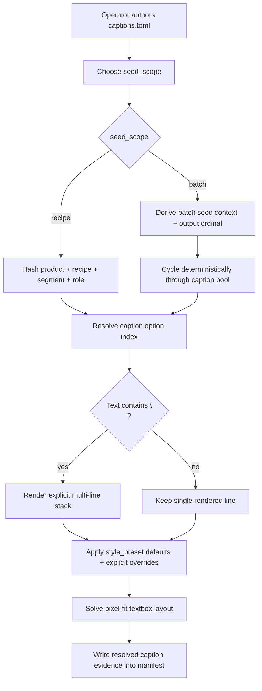
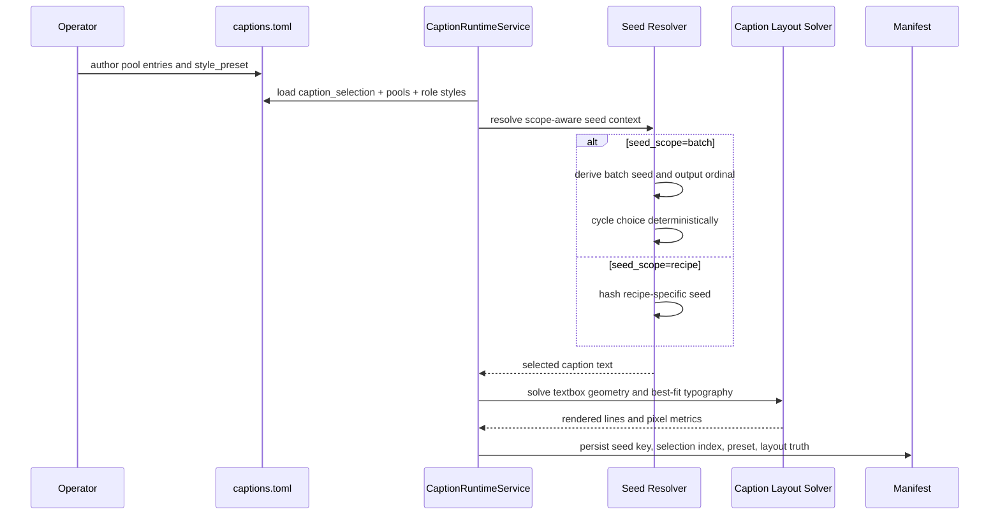

# 68. Caption Batch Cycling And Preset Tuning Workflow

## Purpose

This SSOT slice hardens two quality gaps found during real `Biothentic0001` auto-mode preview runs:

1. `seed_scope = "batch"` could still yield repetitive caption choices across the first outputs in one batch.
2. built-in promo-card presets still leaned too large and too opaque for presenter-led short-form ad previews.

The goal is to keep deterministic automation while reducing obvious repetition and making default promo cards look more operator-ready before product-specific fine tuning.

## Problems Observed

- multiple outputs in the same batch could present the same hook/sub caption pair too often
- headline cards occupied too much of the face-safe area
- grouped headline spacing still needed a more compact baseline
- lower-third cards needed a lighter default holdout and a larger readability baseline

## Design Decisions

### 1. Batch Scope Means Deterministic Rotation Across Outputs

`seed_scope = "batch"` now means:

- one deterministic batch seed is derived from the recipe batch context
- the output ordinal inside that batch rotates the caption choice deterministically
- rerunning the same batch still produces the same caption choice for the same output ordinal
- a later output may repeat once the caption pool is exhausted, but the early outputs should not all collapse onto one choice when enough pool entries exist

`seed_scope = "recipe"` remains the per-recipe deterministic mode.

### 2. Explicit `\n` Still Owns Multi-Line Intent

The runtime still treats `\n` as the only multi-line authoring signal.

- if the caption text includes `\n`, the runtime renders multiple lines and resolves best-fit layout for that authored stack
- if the caption text does not include `\n`, the runtime keeps one rendered line and solves font size against the textbox width

This remains important for operator predictability and auditability.

### 3. Preset Defaults Shift Toward Presenter-Safe Promo Cards

`sale_blast` and `dark_lower_third` are retuned so that:

- top headline cards default to a slightly narrower and lighter banner
- grouped headline stacks use tighter line advance and smaller line spacing
- lower-third cards default to a larger readable type baseline
- lower-third opacity reduces enough to hold readability without burying the presenter

## Workflow

## Sequence

## Contract Guidance

- use `seed_scope = "batch"` when the operator wants the first outputs in one run to vary while staying rerun-safe
- keep `main` copy short and high-energy; use `\n` only for intentional line breaks
- keep `sub` copy concise because single-line behavior is still explicit-intent only
- rely on `style_preset` for the first-pass look, then override only the fields the product truly needs

## Verification

This slice must be verified by:

- pytest coverage for deterministic batch-scope rotation
- pytest coverage for updated preset defaults
- a real product-folder rerun such as `Biothentic0001` with extracted preview frames for visual audit
