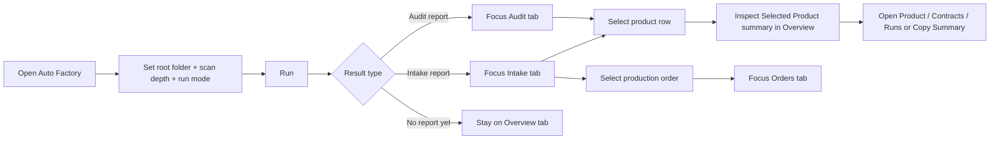
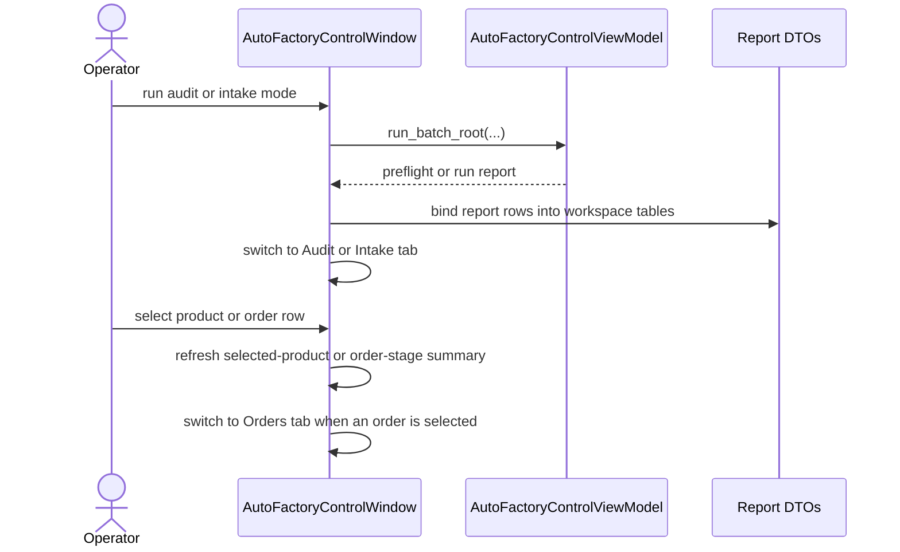

# Auto Factory Tabbed Workspace Layout 2026-06-20

This document is the SSOT for the first layout-hardening pass of the desktop `Auto Factory` operator surface.

It extends [37_Auto_Factory_Control_Surface_Workflow_2026-06-13.md](/F:/programming/python/MTClipFactory/doc/37_Auto_Factory_Control_Surface_Workflow_2026-06-13.md), [63_Auto_Factory_Operations_Control_Requirements_2026-06-19.md](/F:/programming/python/MTClipFactory/doc/63_Auto_Factory_Operations_Control_Requirements_2026-06-19.md), [66_Auto_Factory_Product_Contract_Review_Surface_2026-06-19.md](/F:/programming/python/MTClipFactory/doc/66_Auto_Factory_Product_Contract_Review_Surface_2026-06-19.md), and [67_Auto_Factory_Review_Surface_Operator_Actions_2026-06-20.md](/F:/programming/python/MTClipFactory/doc/67_Auto_Factory_Review_Surface_Operator_Actions_2026-06-20.md).

## Purpose

- stop the `Auto Factory` window from collapsing key controls, table headers, and review panels when many surfaces are shown together
- keep run controls, review truth, and recent-order history visible without forcing operators to fight one over-compressed vertical stack
- preserve truthful DTO-backed review content while making the UI physically usable on common desktop sizes

## Problem Statement

The first `Auto Factory` screen proved the service seams and operator workflow, but the all-panels-visible layout created real UI failure modes:

1. selected-product action buttons could become cramped or visually collide with the summary area
2. narrow tables clipped headers such as `Requested Outputs` and `Registered Assets`
3. recent-order history lost too much height and became hard to scan
4. operators were asked to parse audit, intake, and order-stage surfaces at the same time even though those surfaces belong to different moments in the workflow

## Core Decision

- keep one left-side control column for run setup
- keep one bottom recent-orders surface visible as a persistent history strip
- move right-side result surfaces into a tabbed workspace instead of stacking every panel vertically
- auto-focus the most relevant tab after each workflow step:
  - `Audit` after preflight
  - `Intake` after intake/materialize report refresh
  - `Orders` after selecting a persisted production order
- keep `Overview` as the default home for run summary plus selected-product review

## Workspace Layout

### Left Column

- `Run Controls`
- root folder, batch code, `scan_depth`, run mode
- run-mode guidance
- primary actions and status/feedback

### Right Tabbed Workspace

- `Overview`
  - latest run summary
  - selected product contract/runtime summary
- `Audit`
  - audit product summary
  - audit issues
- `Intake`
  - intake product reports
  - intake asset actions
- `Orders`
  - selected production-order summary and stages

### Bottom Strip

- `Recent Production Orders`
- stays visible independently from the active right-side tab

## Workflow

## Sequence

## Layout Rules

- controls column must keep a practical minimum width
- selected-product actions should render as stable button blocks, not one fragile over-compressed row
- data tables should default to header-safe column sizing with stretch on the most narrative columns
- recent-order history must retain its own minimum height instead of losing space to every other result panel
- the UI should prefer fewer simultaneously visible contexts over one overloaded panel stack

## Delivered Slice

- delivered a horizontal workspace split between run controls and result review
- delivered a vertical page split that protects recent-order history space
- delivered tabbed result workspaces for `Overview`, `Audit`, `Intake`, and `Orders`
- delivered stronger table header sizing defaults and minimum panel heights
- delivered tab-focus behavior that follows audit, intake, and order-selection workflow context
- delivered pytest coverage for the new workspace structure and tab switching behavior

## Acceptance Criteria

- the selected-product panel remains readable and actionable on normal desktop window sizes
- recent-order history remains visible without stealing the entire operator workspace
- audit, intake, and order-stage surfaces no longer compete for the same small vertical slice
- the upgraded layout stays truthful to existing DTO-backed content and does not introduce editing side effects
