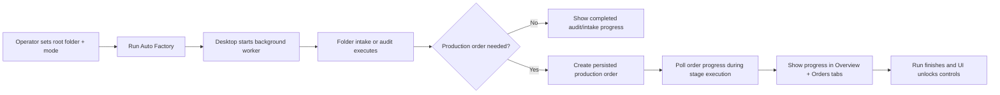
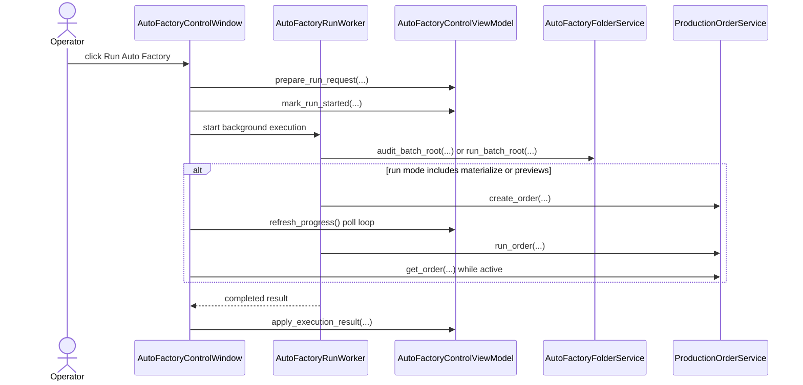

# Auto Factory Live Progress And Control Groundwork 2026-06-20

This document is the SSOT for the first live-progress execution slice of the desktop `Auto Factory` control surface.

It extends [63_Auto_Factory_Operations_Control_Requirements_2026-06-19.md](/F:/programming/python/MTClipFactory/doc/63_Auto_Factory_Operations_Control_Requirements_2026-06-19.md), [69_Auto_Factory_Tabbed_Workspace_Layout_2026-06-20.md](/F:/programming/python/MTClipFactory/doc/69_Auto_Factory_Tabbed_Workspace_Layout_2026-06-20.md), and [35_Production_Order_And_Orchestration_Workflow_2026-06-13.md](/F:/programming/python/MTClipFactory/doc/35_Production_Order_And_Orchestration_Workflow_2026-06-13.md).

Historical note: this document remains the SSOT for the original background-worker plus live-progress groundwork slice only. Backend-functional local-worker `Pause Run`, `Stop Run`, and `Resume Run` behavior is now delivered separately in [71_Auto_Factory_Persisted_Run_Control_Local_Worker_Baseline_2026-06-20.md](/F:/programming/python/MTClipFactory/doc/71_Auto_Factory_Persisted_Run_Control_Local_Worker_Baseline_2026-06-20.md), so this file should be read as historical slice context rather than the current run-control truth boundary.

## Purpose

- let operators press `Run Auto Factory` without freezing the desktop window
- surface truthful run progress while intake or production-order stages are still executing
- prepare the operator control surface for later `Pause`, `Stop`, and `Resume` work without pretending those commands are already safe in this first slice

## Problem Statement

The previous `Auto Factory` screen could launch work, but execution still had two operator-grade gaps:

1. the UI thread blocked during long runs, so the window could not act like a real monitoring surface
2. the screen talked about operational control, but there was no truthful seam yet for safe `Pause`, `Stop`, or `Resume`

## Core Decision

- move the desktop run trigger onto a background worker thread
- keep production truth in the existing folder-service and production-order-service seams
- poll persisted production-order state while a monitored order is running
- expose control buttons now, but keep them explicitly non-authoritative until worker-lease and safe-checkpoint backend semantics exist

## Delivered Execution Shape

### Background Run

- `Run Auto Factory` now starts a background worker instead of blocking the desktop event loop
- the window disables setup controls while a run is active
- the window keeps refreshing progress truth during the active run

### Live Progress Surface

The `Overview` tab now includes a dedicated `Run Progress` panel that reports:

- run state
- current phase
- run mode
- root folder
- batch code
- monitored production order id/code when available
- order status
- current stage
- product counts
- requested output count
- materialized recipe count
- preview completed count
- review-required count
- recorded stage count
- active worker count
- last event
- blocking reason when available

### Orders Surface Hardening

- the `Orders` tab now also shows a per-product progress table
- each row summarizes product code, requested outputs, latest stage, and current status

### Operator Control Groundwork

- `Refresh Progress` is active and truthful
- `Pause Run`, `Stop Run`, and `Resume Run` first became visible here as the intended operator command surface
- at the time of this groundwork-only slice, those three controls still reported `pending backend support`; current backend-functional control truth now lives in document `71`

## Workflow

## Sequence

## Truth Boundaries

- current active-worker truth is still `single local worker` only
- progress is derived from persisted production-order state plus current run context
- in this groundwork-only slice, `Pause`, `Stop`, and `Resume` were not yet claimed as safe or functional
- current persisted lease and safe-checkpoint semantics are now delivered separately in document `71`

## Acceptance Criteria

- the `Auto Factory` window stays responsive during active runs
- operators can see progress update while a monitored production order is executing
- operators can manually refresh progress for historical or selected orders
- the groundwork slice does not falsely advertise pause/stop/resume as working before backend safety semantics exist
