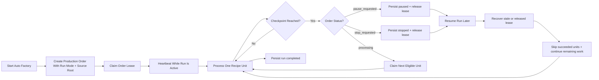
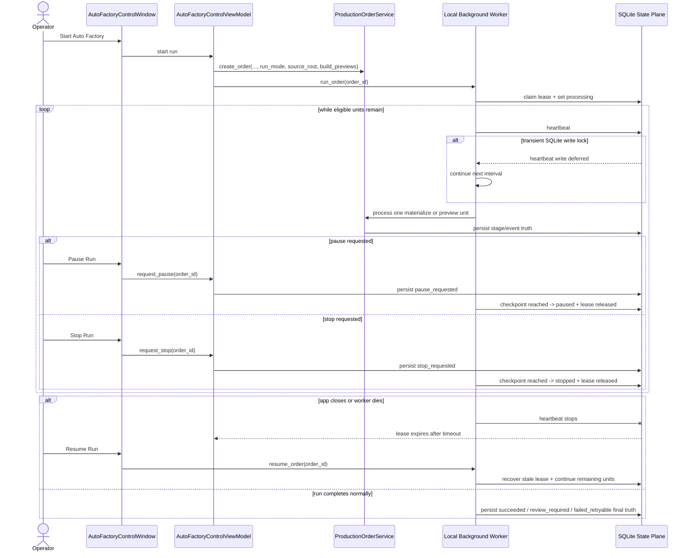

# Auto Factory Persisted Run Control Local Worker Baseline 2026-06-20

Status note: as of 2026-06-20 this document describes the target `IR-20` design only. Persisted worker-lease, safe-checkpoint, and backend-functional `Pause Run` / `Stop Run` / `Resume Run` behavior are not implemented in code yet, so the UI must continue to report `pending backend support`.

It extends [63_Auto_Factory_Operations_Control_Requirements_2026-06-19.md](/F:/programming/python/MTClipFactory/doc/63_Auto_Factory_Operations_Control_Requirements_2026-06-19.md), [70_Auto_Factory_Live_Progress_And_Control_Groundwork_2026-06-20.md](/F:/programming/python/MTClipFactory/doc/70_Auto_Factory_Live_Progress_And_Control_Groundwork_2026-06-20.md), and [34_Enterprise_Factory_Architecture_Blueprint_2026-06-13.md](/F:/programming/python/MTClipFactory/doc/34_Enterprise_Factory_Architecture_Blueprint_2026-06-13.md).

## Purpose

- turn `Pause Run`, `Stop Run`, and `Resume Run` into truthful backend-backed actions for the current desktop local-worker baseline
- add persisted lease and heartbeat semantics so interrupted work can be recovered without database surgery
- define the smallest credible safe-checkpoint model before true multi-worker expansion begins

## Scope Of This Slice

This slice is intentionally limited to the current desktop execution model:

- one local background worker per active desktop-driven auto-factory run
- persisted lease ownership on the `Production Order`
- persisted heartbeat and lease-expiration timestamps
- persisted run mode and source-root truth on the `Production Order`
- append-only order-event journal rows for operator-visible recovery and audit
- safe checkpoints at recipe boundaries
- restart-safe resume for paused, stopped, retryable-failed, or stale-leased orders

Out of scope for this slice:

- true parallel multi-worker dispatch
- mid-render cancellation inside one already-running preview render
- final-render automation beyond the current preview/review boundary

## Core Decision

The target backend-functional control slice uses `Production Order` as both:

1. the persisted operator intent record
2. the current lease owner and heartbeat truth

This is a local-worker baseline, not the final distributed-worker architecture.

The system remains truthful by saying:

- `Pause` and `Stop` take effect at the next safe checkpoint
- the current safe checkpoint is after one recipe materialization unit or one preview-job unit
- a currently executing preview render is not forcibly killed mid-frame in this slice

## Persistence Direction

The `production_orders` row should now also carry:

- persisted run mode
- persisted source root folder
- persisted preview-enabled flag
- lease owner
- lease acquired time
- last heartbeat time
- lease expiration time
- blocking reason

The control-plane should also add one append-only `production_order_events` table for:

- run start
- lease claimed
- lease heartbeat recovery events
- stage started
- stage completed
- pause requested
- paused
- stop requested
- stopped
- resume requested
- stale lease recovered
- run completed
- run blocked

## Local Worker Lease Rules

- only one local worker may hold the lease for one order at a time
- the worker must heartbeat while the order is active
- if the app or worker dies, the lease eventually expires
- a later `Resume Run` may recover that stale lease and continue remaining work
- active-worker truth remains `0` or `1` in this slice

### SQLite Contention Rule

- the current desktop baseline uses SQLite, so lease-heartbeat writes can temporarily contend with other persisted stage or event writes
- one transient `database is locked` heartbeat failure must not be treated as worker death by itself
- heartbeat execution should tolerate transient SQLite lock contention, skip that single heartbeat attempt, and continue retrying on the next normal interval
- lease timeout remains the authoritative stale-worker boundary, so a worker becomes stale only after heartbeat expiry rather than after one missed write attempt

## Safe Checkpoint Rules

The first safe checkpoints are:

1. after one planned recipe is materialized completely
2. after one materialized recipe preview job finishes

Implications:

- `Pause Requested` stops new unit claims after the current recipe-boundary checkpoint
- `Stop Requested` stops new unit claims after the current recipe-boundary checkpoint
- `Resume Run` continues only the remaining eligible units
- already successful materialize, preview, and review units must be reused

## Resume Rules

Resume must:

- reload the persisted order and item truth
- re-plan deterministically from the order request
- skip materialize units that already succeeded
- skip preview and review units that already succeeded
- retry units whose latest persisted state is `failed_retryable`
- recover a stale lease explicitly and journal that recovery

## Truth Boundaries

- this slice does not promise instant preemption of an already-running FFmpeg preview job
- this slice does not promise more than one real active worker
- this slice does not claim distributed scheduling yet
- this slice does promise persisted operator intents, restart-safe recovery, and truthful order-level lease state

## Workflow

## Sequence

## Acceptance Criteria For This Slice

- `Pause Run` is persisted and becomes `paused` after the next safe checkpoint
- `Stop Run` is persisted and becomes `stopped` after the next safe checkpoint
- `Resume Run` continues remaining eligible work without duplicating completed units
- stale leases become recoverable after app close or worker death
- the UI can inspect real lease, status, and last-event truth from persisted state
- SSOT, UML, roadmap, status, progress, and tests remain aligned
