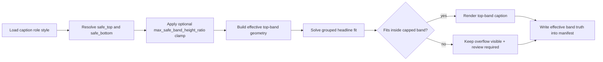
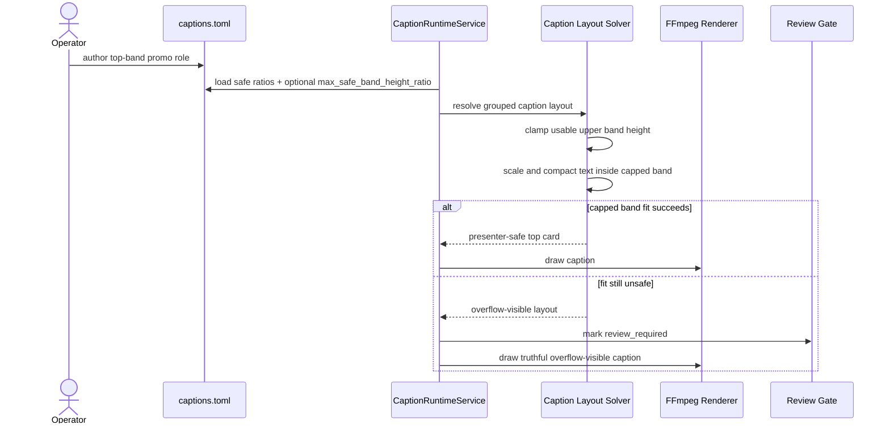

# Top-Band Face-Safe Caption Clamp Workflow 2026-06-20

This document is the SSOT for hardening presenter-led caption layout when top-band promo cards still grow low enough to cover the eyes or upper face.

It complements [50_Caption_Safe_Bands_And_Longest_Layer_Duration_Workflow_2026-06-14.md](/F:/programming/python/MTClipFactory/doc/50_Caption_Safe_Bands_And_Longest_Layer_Duration_Workflow_2026-06-14.md), [51_Textbox_Based_Caption_Layout_Workflow_2026-06-15.md](/F:/programming/python/MTClipFactory/doc/51_Textbox_Based_Caption_Layout_Workflow_2026-06-15.md), and [64_Manual_Break_Compaction_And_Face_Safe_Headline_Workflow_2026-06-19.md](/F:/programming/python/MTClipFactory/doc/64_Manual_Break_Compaction_And_Face_Safe_Headline_Workflow_2026-06-19.md).

## Purpose

- stop grouped top-band headline cards from extending too far into the presenter eye line
- keep operator-authored `safe_top_ratio` and `safe_bottom_ratio` useful without letting one tall content-hug box consume the whole upper band
- preserve truthful review behavior when text still cannot fit the safer upper band

## Problem Statement

Real presenter-led auto-factory previews showed a remaining gap:

- top promo cards could still fit inside the declared upper safe band while visually covering the presenter eyes
- aggressive product-local overrides such as larger `font_size`, wider `textbox_width_ratio`, and `3-line` grouped cards could undo the safer intent of built-in presets
- the runtime had no separate concept for `maximum allowed top-band height`; it only knew the full safe-band bounds

## Core Decisions

1. The runtime must support a second cap besides `safe_top_ratio` and `safe_bottom_ratio`.
2. That cap is `max_safe_band_height_ratio`.
3. For top-band headline cards, the effective lower bound becomes:
   `min(safe_bottom_ratio, safe_top_ratio + max_safe_band_height_ratio)`.
4. The best-fit solver must size text against that effective capped band instead of the larger uncapped upper band.
5. If the text still overflows after scaling to the safer cap, the output must remain review-visible instead of silently dropping below the presenter eye line.
6. Presenter-oriented presets such as `sale_blast` should carry a tighter default cap than the older generic upper-band behavior.

## Runtime Rule

Each caption role may now declare:

- `safe_top_ratio`
- `safe_bottom_ratio`
- `max_safe_band_height_ratio`

Interpretation:

- `safe_top_ratio` still anchors where the role may begin
- `safe_bottom_ratio` still declares the absolute lower bound for the role
- `max_safe_band_height_ratio` limits how tall the usable band may become even if the absolute lower bound is deeper

Example:

- `safe_top_ratio = 0.05`
- `safe_bottom_ratio = 0.30`
- `max_safe_band_height_ratio = 0.18`

Effective rule:

- the role may start at `5%` from the top
- the uncapped band could extend to `30%`
- the capped usable band stops at `23%` because `0.05 + 0.18 = 0.23`

## Presenter-Safe Outcome

For grouped top-band `main` captions:

- text should scale down before the card grows deep enough to cover the presenter eyes
- multi-line promo hooks may still compact from `3 lines` toward `2`
- if the card still cannot fit the capped upper band, overflow remains review-visible

## Workflow

## Sequence Diagram

## Acceptance Criteria

- grouped top-band `main` captions scale down before growing into the presenter eye line
- `max_safe_band_height_ratio` is available through product contracts and preset defaults
- built-in presenter-oriented presets use a tighter default top-band cap than the prior baseline
- manifest-visible caption evidence includes the new resolved band-limit truth
- overflow remains review-visible when the safer cap still cannot contain the text
