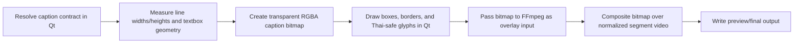
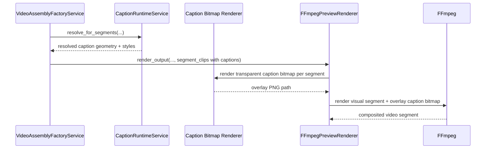

# Thai-Safe Caption Bitmap Overlay Workflow 2026-06-20

This document is the SSOT for caption rendering when Thai text quality cannot stay truthful if layout is measured in Qt but glyphs are rendered later by a different text engine inside FFmpeg.

It complements [51_Textbox_Based_Caption_Layout_Workflow_2026-06-15.md](/F:/programming/python/MTClipFactory/doc/51_Textbox_Based_Caption_Layout_Workflow_2026-06-15.md), [57_Explicit_Line_Break_And_Box_Aware_Caption_Composition_Workflow_2026-06-15.md](/F:/programming/python/MTClipFactory/doc/57_Explicit_Line_Break_And_Box_Aware_Caption_Composition_Workflow_2026-06-15.md), [62_Promo_Headline_Compression_Workflow_2026-06-16.md](/F:/programming/python/MTClipFactory/doc/62_Promo_Headline_Compression_Workflow_2026-06-16.md), and [72_Top_Band_Face_Safe_Caption_Clamp_Workflow_2026-06-20.md](/F:/programming/python/MTClipFactory/doc/72_Top_Band_Face_Safe_Caption_Clamp_Workflow_2026-06-20.md).

## Purpose

- keep Thai captions truthful when vowel marks and tone marks look visually wrong after a second renderer reinterprets the measured layout
- ensure the engine that measures caption geometry is also the engine that draws the final glyphs
- preserve current contract-driven caption layout, textbox, border, and overflow behavior without asking operators to reauthor Thai copy differently

## Problem Statement

The caption pipeline already resolves textbox geometry and line positions in Qt-aware pixel space, but the previous render path still asked FFmpeg `drawtext` and `drawbox` to recreate those glyphs later.

That split created a high-risk gap:

1. Qt measured one glyph stack and one line height.
2. FFmpeg then redrew the same text with a different shaping and glyph-rasterization path.
3. Thai top vowels, lower vowels, and tone marks could look visually wrong even when the measured layout was "correct".

This is not only a line-spacing issue. It is a renderer-consistency issue.

## Core Decisions

1. Caption layout remains contract-driven and Qt-measured exactly as before.
2. Caption glyphs and caption boxes must now be rasterized into one transparent RGBA bitmap in Qt before FFmpeg compositing.
3. FFmpeg should no longer be responsible for drawing Thai caption glyphs directly in the normal caption path.
4. FFmpeg remains responsible for visual compositing only by overlaying the already-rendered caption bitmap.
5. The same bitmap path applies to grouped and `per_line` textbox modes so contract behavior stays consistent.
6. Manifest caption evidence remains geometry-first and truthful to the resolved runtime contract.

## Runtime Rule

When a segment has resolved captions:

- build one transparent frame-sized caption bitmap for that segment
- draw grouped or per-line caption boxes on that bitmap
- draw each caption line using the same Qt font family and pixel size that the layout solver already resolved
- pass that bitmap to FFmpeg as an overlay input

When a segment has no captions:

- skip the bitmap input entirely
- render the visual segment normally

## Workflow

## Sequence Diagram

## Expected Outcomes

- Thai vowels and tone marks are rendered by the same Qt stack that measured the geometry
- grouped headline cards keep their current contract-driven widths, borders, and face-safe band rules
- `per_line` textbox mode keeps independent per-line card geometry without asking FFmpeg to rebuild text boxes itself
- the caption path stays deterministic and testable under `pytest`

## Non-Goals

- semantic rewriting of Thai caption copy
- OCR or face-detection-driven repositioning
- changing the existing contract schema just to compensate for renderer mismatch
