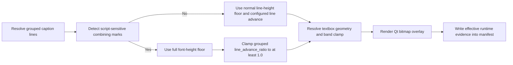
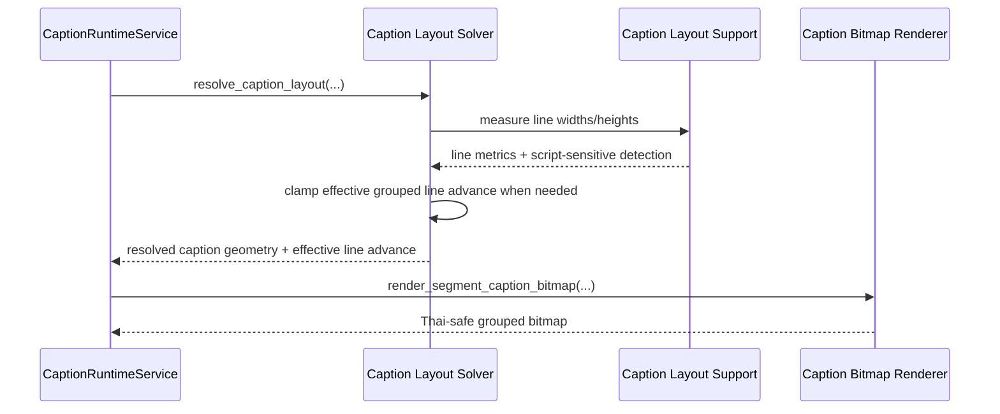

# Thai Script-Safe Line Advance Workflow 2026-06-20

This document is the SSOT baseline for grouped multi-line caption layout when Thai text contains above-baseline or below-baseline vowel and tone marks that cannot stay readable if line advance is compressed as aggressively as Latin promo text.

It complements [51_Textbox_Based_Caption_Layout_Workflow_2026-06-15.md](/F:/programming/python/MTClipFactory/doc/51_Textbox_Based_Caption_Layout_Workflow_2026-06-15.md), [62_Promo_Headline_Compression_Workflow_2026-06-16.md](/F:/programming/python/MTClipFactory/doc/62_Promo_Headline_Compression_Workflow_2026-06-16.md), [72_Top_Band_Face_Safe_Caption_Clamp_Workflow_2026-06-20.md](/F:/programming/python/MTClipFactory/doc/72_Top_Band_Face_Safe_Caption_Clamp_Workflow_2026-06-20.md), and [73_Thai_Safe_Caption_Bitmap_Overlay_Workflow_2026-06-20.md](/F:/programming/python/MTClipFactory/doc/73_Thai_Safe_Caption_Bitmap_Overlay_Workflow_2026-06-20.md). Its whole-block safety rule is now further refined by [75_Thai_Pair_Aware_Line_Spacing_Workflow_2026-06-20.md](/F:/programming/python/MTClipFactory/doc/75_Thai_Pair_Aware_Line_Spacing_Workflow_2026-06-20.md).

## Purpose

- keep Thai multi-line caption stacks readable when operators request compact grouped headline cards
- stop grouped `line_advance_ratio` compression from visually colliding Thai upper vowels, lower vowels, and tone marks across adjacent lines
- preserve truthful manifest evidence by recording the effective runtime line advance that was actually safe enough to render

## Problem Statement

The caption system already supports grouped multi-line headline compression through `line_advance_ratio`, and the new bitmap-overlay path now ensures one measured-and-drawn Qt renderer for Thai glyphs.

That solved renderer mismatch, but one truthful risk remained:

1. the grouped solver still allowed compressed line advance below full font-height spacing
2. Thai lines with combining marks can occupy more meaningful vertical space than a compact Latin promo headline
3. a contract value such as `line_advance_ratio = 0.78` can therefore create visually collided Thai stacks even when the renderer itself is correct

This is a layout-safety problem, not only a rasterization problem.

## Core Decisions

1. Grouped multi-line caption compression remains valid for Latin-like promo text.
2. Thai or other combining-mark-heavy lines must switch into a script-safe vertical-spacing rule before final placement is accepted.
3. When script-safe mode is active, line-height measurement must use a full font-height floor instead of an ink-tight Latin-biased floor.
4. The initial safe baseline promoted grouped `line_advance_ratio` to at least `1.0`, but pair-aware refinement is now allowed to keep safer compact spacing on low-risk adjacent line pairs.
5. Manifest/runtime evidence must expose the effective resolved line advance, not only the requested contract value.
6. `per_line` textbox mode keeps its existing independent line behavior because it already renders without grouped vertical compression.

## Runtime Rule

When grouped multi-line caption text contains script-sensitive combining marks:

- keep Qt measurement and Qt drawing on the same engine path
- resolve line height with a full font-height safety floor
- apply the baseline safe rule described here unless the pair-aware workflow in document `75` resolves a more precise adjacent-line result
- continue applying band clamps, textbox width limits, and overflow review truth normally

When grouped text does not contain script-sensitive combining marks:

- preserve current compact headline behavior
- allow configured grouped `line_advance_ratio` compression within the existing bounded range

## Workflow

## Sequence Diagram

## Expected Outcomes

- Thai grouped headlines no longer visually collide just because a Latin-tuned compact ratio was requested
- compact grouped headline styling still works for scripts that can safely tolerate tighter vertical stacking
- manifests remain truthful because they report the effective safe ratio actually used at runtime
- operator contract tuning stays predictable and testable under `pytest`
