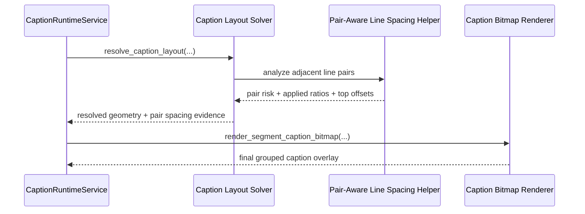

# Thai Pair-Aware Line Spacing Workflow 2026-06-20

This document is the SSOT for grouped Thai multi-line caption spacing when the system must reason about adjacent line pairs instead of applying one conservative spacing rule to the whole text block.

It complements [73_Thai_Safe_Caption_Bitmap_Overlay_Workflow_2026-06-20.md](/F:/programming/python/MTClipFactory/doc/73_Thai_Safe_Caption_Bitmap_Overlay_Workflow_2026-06-20.md) and refines [74_Thai_Script_Safe_Line_Advance_Workflow_2026-06-20.md](/F:/programming/python/MTClipFactory/doc/74_Thai_Script_Safe_Line_Advance_Workflow_2026-06-20.md).

## Purpose

- keep Thai grouped captions safe without over-loosening every multi-line card
- evaluate spacing risk per adjacent line pair using upper-mark and lower-mark behavior
- preserve tighter visual rhythm for line pairs that do not actually threaten inter-line collisions
- expose truthful runtime evidence for why one pair of lines received more spacing than another

## Problem Statement

The previous Thai-safe line-advance correction improved safety by promoting the entire grouped text block to a full safe floor whenever any script-sensitive mark appeared anywhere in the block.

That was safe, but still too blunt:

1. not every Thai mark configuration creates the same collision risk between adjacent lines
2. the most dangerous case is the upper line extending downward while the lower line extends upward into the same gap
3. many other pairs can still keep a tighter promo-card rhythm without visual damage

The solver therefore needs pair-aware spacing, not only whole-block safe mode.

## Line-Pair Model

Each rendered line is analyzed for:

- `has_upper_marks`
- `has_lower_marks`

Each adjacent pair is then evaluated from:

- upper line lower-mark depth
- lower line upper-mark height

The primary collision axis is the gap between the two lines:

- upper line lower marks move downward into the gap
- lower line upper marks move upward into the same gap

## Core Decisions

1. Grouped Thai captions keep one shared layout solve, but adjacent line gaps may now resolve differently from each other.
2. Pair risk is evaluated between every `line[i]` and `line[i + 1]`.
3. `high` risk occurs when the upper line has lower marks and the lower line has upper marks.
4. `medium` risk occurs when only one side intrudes into the shared gap.
5. `low` risk keeps the configured compact spacing because the two lines do not meaningfully collide across the gap.
6. Full font-height safety floor for line measurement still applies to script-sensitive lines.
7. Runtime evidence must expose per-pair risk and the applied pair-specific advance ratio.

## Runtime Rule

For grouped multi-line captions:

- analyze each rendered line for upper and lower Thai mark presence
- compute pair risk for each adjacent line pair
- keep the configured base `line_advance_ratio` where pair risk is `low`
- lift pair spacing to a safer minimum where pair risk is `medium`
- lift pair spacing to a full safe floor where pair risk is `high`

For non-grouped or `per_line` captions:

- keep current behavior unchanged

## Workflow

```mermaid
flowchart LR
    A["Resolve rendered caption lines"] --> B["Analyze each line for upper/lower Thai marks"]
    B --> C["Evaluate adjacent line pairs"]
    C --> D["Assign low / medium / high pair risk"]
    D --> E["Resolve per-pair applied advance ratio"]
    E --> F["Compute text block height and line top positions"]
    F --> G["Render Qt bitmap overlay"]
    G --> H["Write pair-aware spacing evidence into manifest"]
```

## Sequence Diagram

## Expected Outcomes

- Thai line pairs that truly threaten collisions get more space
- Thai line pairs that do not threaten collisions can stay tighter
- grouped promo cards remain readable without becoming uniformly loose
- operators and PMs can inspect truthful per-pair evidence in manifests when tuning captions
