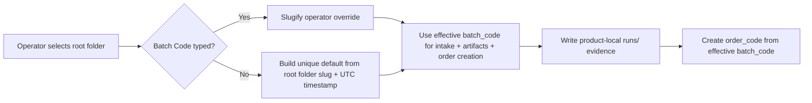
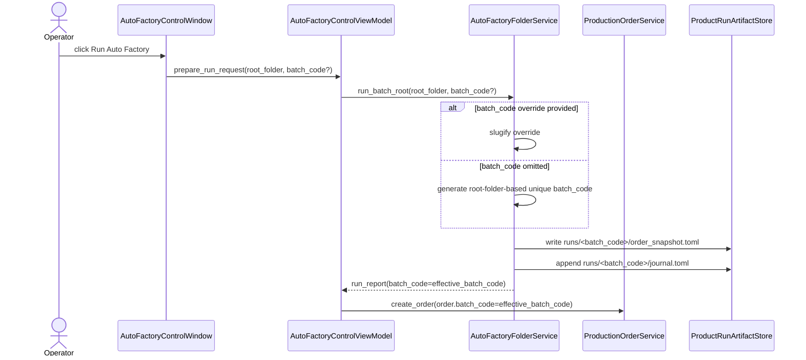

# Auto Factory Default Batch Code Traceability Workflow 2026-06-21

This document is the SSOT for safer default `batch_code` behavior in folder-driven Auto Factory runs.

It extends [37_Auto_Factory_Control_Surface_Workflow_2026-06-13.md](/F:/programming/python/MTClipFactory/doc/37_Auto_Factory_Control_Surface_Workflow_2026-06-13.md), [47_Product_Local_Run_Artifacts_And_Fill_Policy_Workflow_2026-06-14.md](/F:/programming/python/MTClipFactory/doc/47_Product_Local_Run_Artifacts_And_Fill_Policy_Workflow_2026-06-14.md), [63_Auto_Factory_Operations_Control_Requirements_2026-06-19.md](/F:/programming/python/MTClipFactory/doc/63_Auto_Factory_Operations_Control_Requirements_2026-06-19.md), and [70_Auto_Factory_Live_Progress_And_Control_Groundwork_2026-06-20.md](/F:/programming/python/MTClipFactory/doc/70_Auto_Factory_Live_Progress_And_Control_Groundwork_2026-06-20.md).

## Purpose

- keep blank `Batch Code` input convenient for operators
- stop repeated root-folder names such as `products` from collapsing multiple runs into one ambiguous artifact label
- preserve product-local `runs/<batch_code>` traceability without forcing manual batch-code typing every time

## Problem Statement

The previous desktop behavior treated a blank `Batch Code` input as `root_folder.name`.

That was readable, but it created an operator-grade traceability gap:

1. repeated runs from the same root folder could reuse the same `batch_code`
2. product-local audit folders under `runs/<batch_code>` became harder to distinguish
3. rerun evidence such as `order_snapshot.toml`, `journal.toml`, manifests, and preview/final outputs could look like one long mixed batch history instead of one clearly separated run

## Core Decision

- keep manual `Batch Code` override fully supported
- when the operator leaves `Batch Code` blank, generate a unique default from the selected root folder stem plus a UTC timestamp
- the generated default must stay slug-safe for paths and codes
- the generated default becomes the single source of truth for:
  - folder-intake report `batch_code`
  - persisted `Production Order.batch_code`
  - product-local `runs/<batch_code>` artifact layout
  - auto-generated `order_code` prefixing

Recommended generated shape:

- `<root_folder_slug>_<YYYYMMDD_HHMMSS_microseconds>`

Example:

- `products_20260621_154233_182451`

## Workflow

## Sequence

## Acceptance Criteria

- blank `Batch Code` input no longer reuses the bare root-folder name alone
- manual operator overrides still win when provided
- generated defaults stay deterministic within one run request and are safe for product-local paths
- repeated runs from the same root folder produce distinct `runs/<batch_code>` directories by default
- tests cover both generated-default and explicit-override behavior
