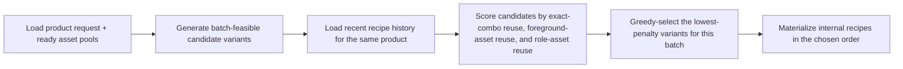
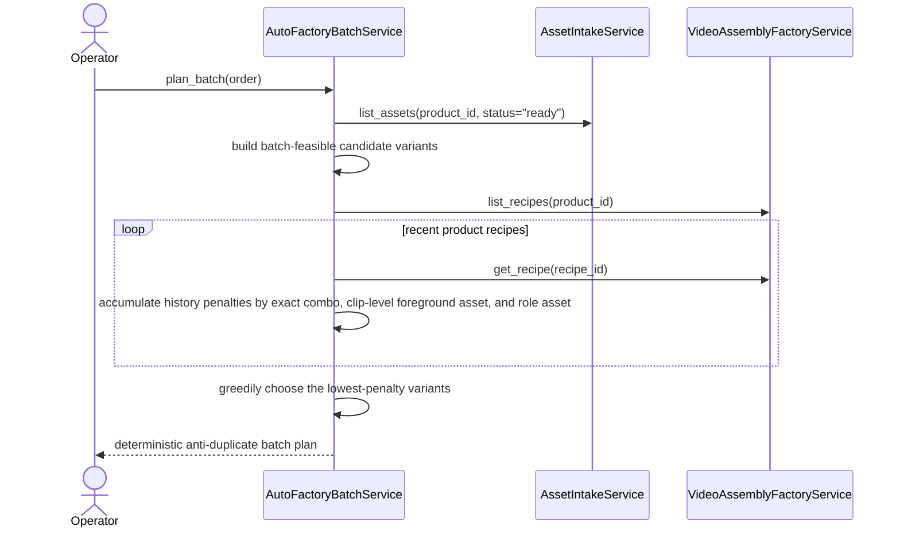

# Auto Factory History-Aware Anti-Duplicate Selection Workflow 2026-06-21

This document is the SSOT for the first history-aware anti-duplicate selection slice inside Auto Factory batch planning.

It extends [32_Auto_Factory_Batch_Production_Workflow.md](/F:/programming/python/MTClipFactory/doc/32_Auto_Factory_Batch_Production_Workflow.md), [38_Tag_Aware_Auto_Factory_Selection_Workflow_2026-06-13.md](/F:/programming/python/MTClipFactory/doc/38_Tag_Aware_Auto_Factory_Selection_Workflow_2026-06-13.md), and [63_Auto_Factory_Operations_Control_Requirements_2026-06-19.md](/F:/programming/python/MTClipFactory/doc/63_Auto_Factory_Operations_Control_Requirements_2026-06-19.md).

The next explainability layer for this same anti-duplicate stream is now defined in [78_Auto_Factory_Near_Duplicate_Similarity_Workflow_2026-06-21.md](/F:/programming/python/MTClipFactory/doc/78_Auto_Factory_Near_Duplicate_Similarity_Workflow_2026-06-21.md).

Operator-grade Auto Factory clips now follow the persistent one-foreground-plus-one-background policy defined in [88_Auto_Factory_Persistent_Foreground_Background_Clip_Policy_2026-06-21.md](/F:/programming/python/MTClipFactory/doc/88_Auto_Factory_Persistent_Foreground_Background_Clip_Policy_2026-06-21.md). The internal `foreground_sequence` concept remains as planner compatibility state, but it now represents repeated use of one clip-level foreground asset for Auto Factory materialization.

## Purpose

- reduce repeated clip structures that platforms may interpret as duplicate content
- make Auto Factory use the product's own recent recipe history when choosing the next batch variants
- improve commercial variety without giving up deterministic planning or operator traceability

## Problem Statement

The previous planner already prevented duplicate fingerprints inside one batch, but that was not enough for short-form ad publishing.

Real operator risk remained:

1. a new batch could still start with the same effective asset combination as the previous batch
2. one voiceover or one familiar foreground pattern could be reused too aggressively across repeated runs
3. duplicate-risk scoring remained more visible after recipe creation than preventative during candidate selection

That gap is operationally important because platforms such as Shopee Video and TikTok may suppress or devalue content that looks too repetitive.

## Core Decision

- keep the current `batch-only` uniqueness fingerprint rule
- add one new history-aware ranking layer before recipe materialization
- use recent recipe history for the same product as the first anti-duplicate evidence source
- penalize historically repeated exact assignment signatures, repeated clip-level foreground assets, and overused role-specific assets
- weight `voice` more heavily than `background` or `music` because repeated spoken copy makes ad outputs feel duplicate faster

This slice stays intentionally local to MTClipFactory truth:

- it does not claim platform-native duplicate detection
- it does not yet require new database tables
- it does not yet add operator-tunable cooldown knobs in `pipeline.toml`

## Selection Rule

When multiple batch-feasible variants exist, the planner should prefer candidates that:

1. were not used as the exact same assignment combination in recent recipe history
2. do not repeat the same clip-level foreground asset too often
3. avoid overused `voice`, `hook`, `problem`, `benefit`, `proof`, `cta`, `background`, and `music` assets
4. still remain deterministic under the same batch code and same persisted history

## Workflow

## Sequence

## Truth Boundaries

- the planner now uses internal recipe history, not external platform feedback
- this slice reduces duplication risk; it does not guarantee that every produced clip will be unique enough for every platform policy
- exact duplicate fingerprints inside the current batch remain blocked by the existing batch-uniqueness baseline
- deeper cross-batch cooldown policy and publish-history evidence remain future work

## Delivered Slice

- delivered history-aware planner weighting from recent same-product recipe history
- delivered exact-combo avoidance when a different feasible variant exists
- delivered stronger `voice` reuse penalties than lower-value background or music reuse
- kept planning deterministic for the same batch code plus the same persisted history state
- covered the new behavior with pytest for exact-combo avoidance and voice-overuse avoidance

## Acceptance Criteria

- if one historically repeated exact asset-role combination has a feasible alternative, the planner should prefer the alternative
- if one voiceover is historically overused for the same product and another feasible voice exists, the planner should deprioritize the overused voice
- the planner must stay deterministic under unchanged input state
- no new UI should falsely claim platform-native duplicate detection that is not actually implemented
