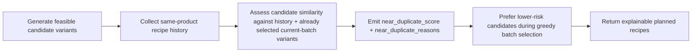
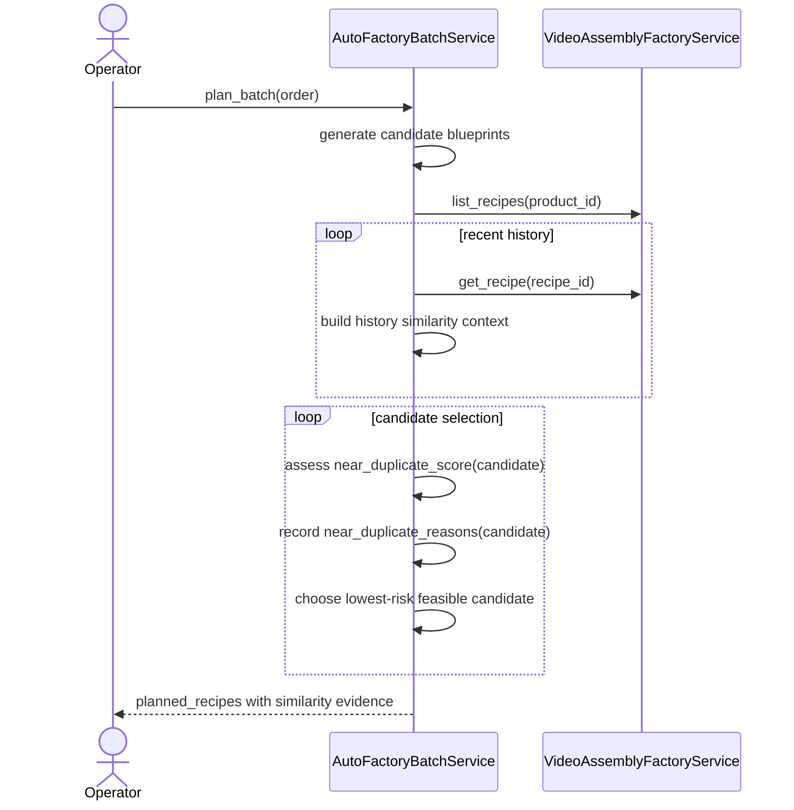

# Auto Factory Near-Duplicate Similarity Workflow 2026-06-21

This document is the SSOT for the first explicit near-duplicate similarity layer in Auto Factory planning.

It extends [32_Auto_Factory_Batch_Production_Workflow.md](/F:/programming/python/MTClipFactory/doc/32_Auto_Factory_Batch_Production_Workflow.md) and [77_Auto_Factory_History_Aware_Anti_Duplicate_Selection_Workflow_2026-06-21.md](/F:/programming/python/MTClipFactory/doc/77_Auto_Factory_History_Aware_Anti_Duplicate_Selection_Workflow_2026-06-21.md).

## Purpose

- make anti-duplicate planning explainable instead of only penalty-based
- expose a `near_duplicate_score` for each planned recipe before materialization
- let operators and future policy layers distinguish exact duplicates from high-risk near duplicates

## Problem Statement

The previous history-aware slice improved selection, but it still worked mostly as an internal ranking heuristic.

That left one important gap:

1. the planner could avoid many bad candidates, but it did not expose a single explainable near-duplicate score
2. later systems could not easily tell why one candidate was considered risky
3. future cooldown or threshold policy had no explicit score surface to build on

## Core Decision

- keep exact fingerprint blocking as a separate hard rule
- add one explicit `near_duplicate_score` in the planner result DTO
- add one explicit `near_duplicate_reasons` list in the planner result DTO
- compute similarity from the same internal evidence the planner already trusts:
  - exact combo reuse
  - foreground-sequence reuse
  - role-asset reuse with heavier `voice` weighting
  - internal foreground repetition

## Similarity Meaning

`near_duplicate_score` is a planner-side risk indicator in the range `0.0` to `1.0`.

Interpretation:

- `0.0` means the planner found no strong duplicate-like signal from current batch context plus recent same-product history
- values closer to `1.0` mean the candidate looks too similar to recent product outputs under the current internal evidence model

This score is not a platform-native duplicate detector.

## Workflow

## Sequence

## Delivered First Signals

The first explicit reasons should include signals such as:

- `exact_combo_reused`
- `foreground_sequence_reused`
- `voice_asset_overused`
- `background_asset_reused`
- `music_asset_reused`
- `foreground_role_assets_reused`
- `foreground_sequence_internal_repeats`

## Truth Boundaries

- this score is an internal planning-risk signal, not a publish guarantee
- a low score lowers duplicate-content risk but does not guarantee platform acceptance
- a high score does not always mean the clip is unusable; it means the planner sees strong repetition evidence

## Acceptance Criteria

- each planned recipe should expose `near_duplicate_score`
- each planned recipe should expose machine-readable `near_duplicate_reasons`
- the planner should continue preferring lower-risk candidates when feasible alternatives exist
- the same input state should keep the score deterministic
