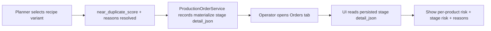
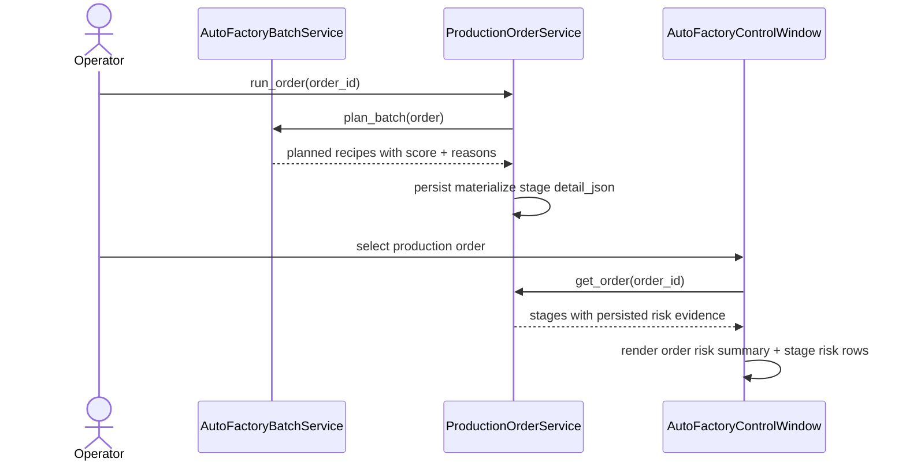

# Auto Factory Operator Near-Duplicate Risk Surface 2026-06-21

This document is the SSOT for the first operator-facing near-duplicate risk surface inside the desktop `Auto Factory` workflow.

It extends [70_Auto_Factory_Live_Progress_And_Control_Groundwork_2026-06-20.md](/F:/programming/python/MTClipFactory/doc/70_Auto_Factory_Live_Progress_And_Control_Groundwork_2026-06-20.md) and [78_Auto_Factory_Near_Duplicate_Similarity_Workflow_2026-06-21.md](/F:/programming/python/MTClipFactory/doc/78_Auto_Factory_Near_Duplicate_Similarity_Workflow_2026-06-21.md).

## Purpose

- let operators inspect duplicate-risk evidence from persisted production-order truth
- avoid hiding planner diversity signals behind service-only DTOs
- keep duplicate-risk visibility truthful by showing persisted planner evidence, not guessed post-hoc UI judgments

## Problem Statement

The planner now computes `near_duplicate_score` and `near_duplicate_reasons`, but the desktop operator surface still has one major gap:

1. operators cannot inspect those signals from the `Orders` tab before deciding whether a batch looks publish-safe
2. the current UI does not distinguish between materialization success and duplicate-risk comfort
3. if the risk surface stays memory-only, historical order review becomes weaker than the control-plane truth already persisted for stages and events

## Core Decision

- persist duplicate-risk evidence on successful `materialize` recipe stages through `detail_json`
- keep the source of truth at the production-order stage layer instead of rebuilding risk from current library state later
- show risk summary plus machine-readable reasons in the `Orders` tab
- treat the score as planner evidence only, not as a platform verdict

## Persisted Evidence Shape

Successful recipe-level `materialize` stages should now retain fields such as:

- `recipe_code`
- `assignment_count`
- `near_duplicate_score`
- `near_duplicate_reasons`
- `fingerprint`

## Operator Surface

The `Orders` tab should expose:

- a per-product progress table that now also shows the latest persisted duplicate-risk score
- a dedicated order-risk summary panel that explains the selected order's current materialization diversity signals
- a stage table that shows duplicate-risk values directly on the `materialize` rows

## Workflow

## Sequence

## Truth Boundaries

- the UI must label this as planner duplicate-risk evidence, not platform detection
- a low score reduces known repetition risk but does not guarantee that Shopee, TikTok, or another platform will accept the clip
- if an older order predates this slice, missing risk fields must display as unavailable rather than guessed

## Acceptance Criteria

- successful `materialize` recipe stages persist duplicate-risk evidence in `detail_json`
- the `Orders` tab can show risk evidence for persisted orders without recalculating planner state
- the operator surface remains truthful when evidence is missing, partial, or from an older order
