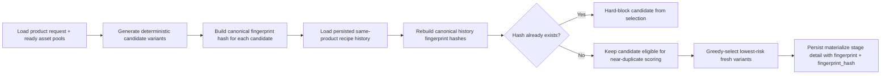
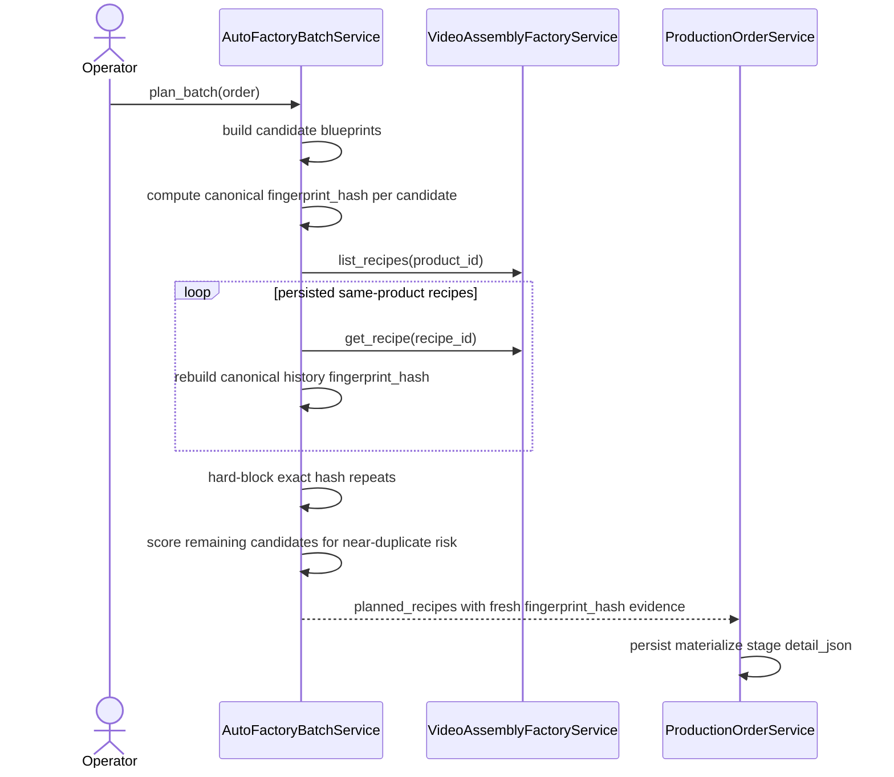

# Auto Factory Exact Fingerprint Hash Duplicate Guard 2026-06-21

This document is the SSOT for the first hard duplicate-prevention guard that uses a canonical recipe fingerprint hash during Auto Factory planning.

It extends [77_Auto_Factory_History_Aware_Anti_Duplicate_Selection_Workflow_2026-06-21.md](/F:/programming/python/MTClipFactory/doc/77_Auto_Factory_History_Aware_Anti_Duplicate_Selection_Workflow_2026-06-21.md), [78_Auto_Factory_Near_Duplicate_Similarity_Workflow_2026-06-21.md](/F:/programming/python/MTClipFactory/doc/78_Auto_Factory_Near_Duplicate_Similarity_Workflow_2026-06-21.md), and [79_Auto_Factory_Operator_Near_Duplicate_Risk_Surface_2026-06-21.md](/F:/programming/python/MTClipFactory/doc/79_Auto_Factory_Operator_Near_Duplicate_Risk_Surface_2026-06-21.md).

## Purpose

- prevent Auto Factory from materializing an exact same internal clip formula again when the same product already has that exact formula in persisted recipe history
- turn duplicate prevention from a soft ranking preference into one deterministic hard guard
- persist a canonical hash seam so later audit, publishing policy, and operator tooling can speak about the same exact-duplicate evidence

## Problem Statement

The current anti-duplicate baseline already improves variety and explains near-duplicate risk, but one operator-grade gap remains:

1. the planner can still repeat an exact known formula when history leaves no better candidate
2. the current `fingerprint` string is useful planner evidence, but there is no canonical hashed guard that can be reconstructed from persisted recipe truth consistently
3. operators who want to avoid platform-level duplicate-content suppression need stronger protection than score-only warnings

## Core Decision

- keep near-duplicate scoring as a soft similarity signal
- add one canonical `fingerprint_hash` as the hard exact-duplicate guard key
- block any candidate whose canonical hash already exists in persisted same-product recipe history
- block any candidate whose canonical hash already exists in the same current batch selection
- keep the guard deterministic under the same product state, batch request, and persisted recipe history

## Canonical Hash Basis

The first canonical duplicate-guard basis should include:

- product code
- target platform
- target ratio
- normalized target duration
- sorted role-to-asset assignments

The basis intentionally excludes transient runtime fields such as worker ids, output paths, and production-order ids.

The basis also avoids depending on planner-only fields that older persisted recipes cannot reconstruct safely.

## Workflow

## Sequence

## Expected Behavior

### Fresh Alternative Exists

- if the exact same formula exists in history and another feasible fresh candidate exists, the fresh candidate must be chosen

### No Fresh Alternative Exists

- if every feasible candidate hash already exists in persisted same-product history, the planner must report a truthful shortfall instead of repeating the old formula silently

### Similar But Not Exact

- if a candidate shares many assets with history but does not produce the same canonical hash, the hard guard must not block it
- those cases remain governed by near-duplicate score and reasons

### Resume Of The Same Production Order

- if a production order already materialized recipes successfully and later resumes after preview or later-stage failure, the planner must ignore those same-order materialized recipes when rebuilding planning history
- that keeps resume deterministic and prevents the order from blocking its own already-created recipes

## Persisted Evidence

Successful `materialize` recipe stages should now retain:

- `recipe_code`
- `assignment_count`
- `near_duplicate_score`
- `near_duplicate_reasons`
- `fingerprint`
- `fingerprint_hash`

## Truth Boundaries

- this guard prevents exact duplicates only within MTClipFactory's own persisted same-product recipe history
- this guard does not claim guaranteed acceptance by Shopee, TikTok, or any other external platform
- near-duplicate similarity still matters because different formulas can still look too similar commercially
- older historical orders may lack `fingerprint_hash` in stage detail, but the planner should still rebuild the guard hash from persisted recipe truth when possible

## Acceptance Criteria

- the planner must hard-block exact canonical fingerprint hash repeats from persisted same-product recipe history
- the planner must still allow non-identical variants that differ outside the canonical hash basis
- exact-duplicate exhaustion must surface as truthful planner shortfall instead of silent reuse
- production-order resume must not be blocked by the same order's own previously materialized recipes
- successful materialize stages must persist both `fingerprint` and `fingerprint_hash`
