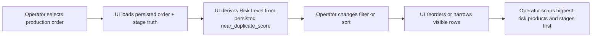
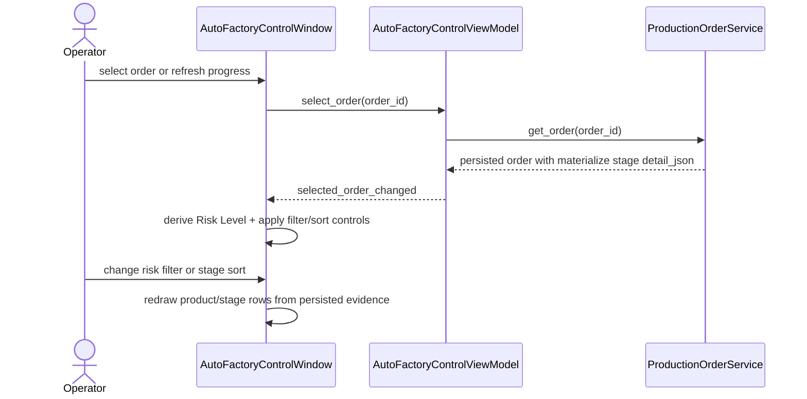

# Auto Factory Orders Risk Emphasis Workflow 2026-06-21

This document is the SSOT for the next operator-visibility slice that adds stronger duplicate-risk emphasis inside the desktop `Auto Factory` `Orders` tab.

It extends [79_Auto_Factory_Operator_Near_Duplicate_Risk_Surface_2026-06-21.md](/F:/programming/python/MTClipFactory/doc/79_Auto_Factory_Operator_Near_Duplicate_Risk_Surface_2026-06-21.md) and [80_Auto_Factory_Exact_Fingerprint_Hash_Duplicate_Guard_2026-06-21.md](/F:/programming/python/MTClipFactory/doc/80_Auto_Factory_Exact_Fingerprint_Hash_Duplicate_Guard_2026-06-21.md).

## Purpose

- let operators scan risky production orders faster without reading every stage row manually
- add truthful presentation emphasis on top of persisted planner evidence that already exists
- improve triage by supporting simple filter and sort controls in the `Orders` tab

## Problem Statement

The current `Orders` tab already exposes persisted duplicate-risk evidence, but one operator-grade gap remains:

1. operators must still read raw numeric scores row by row
2. the current table layout does not help separate `high`, `medium`, `low`, and `unavailable` evidence quickly
3. historical order review becomes slower than necessary when multiple rows contain mixed risk signals

## Core Decision

- keep persisted production-order stage detail as the source of truth
- derive one UI-only `Risk Level` emphasis label from persisted `near_duplicate_score`
- allow filter and sort controls in the `Orders` tab without mutating persisted order data
- keep the thresholds presentation-only, not backend planner policy

## Risk Level Mapping

The first operator-emphasis mapping should be:

- `High` for `near_duplicate_score >= 0.600`
- `Medium` for `0.250 <= near_duplicate_score < 0.600`
- `Low` for `0.000 <= near_duplicate_score < 0.250`
- `Unavailable` when persisted score evidence does not exist

These thresholds are for operator scanning only. They do not change planning, approval, or platform-facing semantics.

## Orders Tab Surface

The `Orders` tab should expose:

- an order summary that includes the current risk focus and risk legend
- one risk filter control
- one stage sort control
- one per-product table with both `Risk Level` and raw score
- one stage table with both `Risk Level` and raw score
- row emphasis that makes higher-risk entries more visible than low-risk or unavailable rows

## Workflow

## Sequence

## Truth Boundaries

- `Risk Level` is a UI emphasis label derived from persisted planner evidence
- `Risk Level` is not a platform-native moderation result
- filtering and sorting must never hide the fact that evidence is missing; `Unavailable` remains a first-class visible state
- the UI must not invent risk values for older orders that lack persisted evidence

## Acceptance Criteria

- the `Orders` tab can derive `High`, `Medium`, `Low`, and `Unavailable` emphasis from persisted score evidence
- operators can filter rows by risk emphasis without changing persisted state
- operators can sort stage rows by risk emphasis or raw risk score
- the order summary explains that the emphasis is planner evidence only, not a platform verdict
