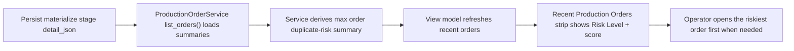
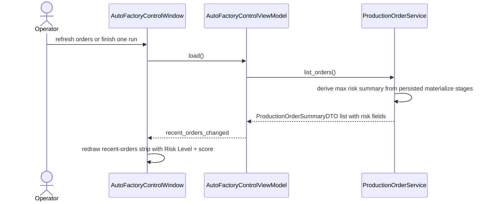

# Auto Factory Recent Orders Risk Summary Workflow 2026-06-21

This document is the SSOT for the next duplicate-risk triage slice that surfaces planner-risk summary directly in the desktop `Auto Factory` `Recent Production Orders` strip.

It extends [81_Auto_Factory_Orders_Risk_Emphasis_Workflow_2026-06-21.md](/F:/programming/python/MTClipFactory/doc/81_Auto_Factory_Orders_Risk_Emphasis_Workflow_2026-06-21.md).

## Purpose

- let operators decide which recent order to inspect first without opening every order one by one
- carry persisted duplicate-risk truth into the lower history strip, not only the selected-order workspace
- keep recent-order triage fast while staying truthful to persisted stage evidence

## Problem Statement

The `Orders` tab is now much easier to read after an order is selected, but one triage gap remains:

1. the bottom `Recent Production Orders` strip still shows status and timing only
2. operators cannot tell which recent order looks riskiest before clicking into it
3. the system already has persisted materialize-stage evidence, but that evidence is not summarized at the recent-order layer yet

## Core Decision

- compute recent-order duplicate-risk summary from persisted `materialize` stage detail only
- expose both derived `Risk Level` and max raw risk score in `ProductionOrderSummaryDTO`
- render those fields directly in the `Recent Production Orders` strip
- keep the summary read-only and derived from persisted truth, not optimistic UI state

## Summary Meaning

For each production order:

- `Risk Level` uses the same `High / Medium / Low / Unavailable` mapping already used in the `Orders` tab
- `Duplicate Risk` shows the maximum persisted materialize-stage `near_duplicate_score` in that order
- `Unavailable` means no persisted materialize-stage risk evidence exists yet

## Workflow

## Sequence

## Truth Boundaries

- recent-order risk summary must come from persisted stage evidence only
- the summary is a quick triage aid, not a complete replacement for opening the selected order
- if a recent order has no persisted materialize-stage risk evidence, the UI must show `Unavailable` instead of guessing

## Acceptance Criteria

- `ProductionOrderSummaryDTO` exposes recent-order risk summary fields derived from persisted stage evidence
- the `Recent Production Orders` strip shows `Risk Level` and raw score
- row emphasis in the strip helps operators notice higher-risk recent orders faster
- orders without persisted evidence remain visible and are labeled `Unavailable`
