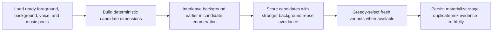
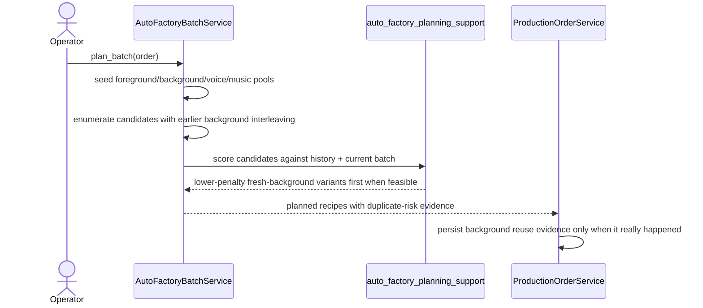

# Auto Factory Background Diversity Hardening Workflow 2026-06-21

This document is the SSOT for the next Auto Factory anti-duplicate hardening slice that reduces repeated `background_video` reuse across clips when fresh alternatives exist.

It extends [77_Auto_Factory_History_Aware_Anti_Duplicate_Selection_Workflow_2026-06-21.md](/F:/programming/python/MTClipFactory/doc/77_Auto_Factory_History_Aware_Anti_Duplicate_Selection_Workflow_2026-06-21.md), [78_Auto_Factory_Near_Duplicate_Similarity_Workflow_2026-06-21.md](/F:/programming/python/MTClipFactory/doc/78_Auto_Factory_Near_Duplicate_Similarity_Workflow_2026-06-21.md), and [80_Auto_Factory_Exact_Fingerprint_Hash_Duplicate_Guard_2026-06-21.md](/F:/programming/python/MTClipFactory/doc/80_Auto_Factory_Exact_Fingerprint_Hash_Duplicate_Guard_2026-06-21.md).

## Purpose

- reduce the chance that multiple clips in one batch all use the same `background_video`
- keep clip assembly commercially varied when the product has more than one usable background
- preserve truthful planner capacity instead of pretending fresh backgrounds exist when they do not

## Problem Statement

The current anti-duplicate stream already penalizes background reuse, but one operator-visible gap remains:

1. candidate enumeration can still surface many `voice` plus `foreground_sequence` combinations before an alternate background ever appears
2. when that happens, the greedy selector may choose from a candidate pool that is unfairly dominated by one background
3. the resulting clips can look too visually repetitive even when fresh `background_video` assets actually exist

That is commercially risky because repeated backgrounds make short-form ads feel templated and easier for platforms or viewers to perceive as duplicate-like.

## Core Decision

- keep `voice` diversity as the highest-priority anti-duplicate dimension
- interleave `background` choices earlier than deep `foreground_sequence` expansion during candidate generation
- increase background reuse avoidance enough that fresh backgrounds are preferred when feasible
- keep this as a preference layer, not a fake hard block

## Expected Behavior

When more than one feasible background exists for the same product request:

- early batch candidates must include alternate backgrounds instead of hiding them behind a large foreground search space
- greedy selection should prefer unused backgrounds before reusing the same background repeatedly
- persisted duplicate-risk reasons may still report `background_asset_reused` when reuse becomes necessary

When only one feasible background exists:

- the planner must continue using it truthfully
- the system must not invent fake variety or under-report risk

## Workflow

## Sequence

## Truth Boundaries

- this slice improves planner-side visual variety; it does not claim platform-native duplicate detection
- background reuse is still allowed when the product has no feasible fresh background left
- any surfaced duplicate-risk evidence must continue to come from persisted planner truth, not post-hoc UI guesses

## Acceptance Criteria

- if multiple feasible backgrounds exist, the planner should surface alternate backgrounds early enough for greedy selection to use them
- the planner should avoid reusing one background across the whole batch when fresh alternatives exist
- `voice` remains more heavily weighted than `background`, but `background` is no longer so weak that it becomes visually ignored
- pytest locks the repeated-background regression scenario
