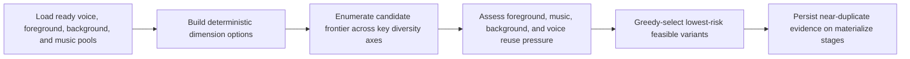
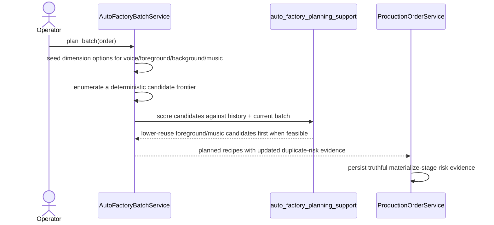

# Auto Factory Foreground And Music Diversity Hardening Workflow 2026-06-21

This document is the SSOT for the next Auto Factory anti-duplicate hardening slice that reduces repeated `foreground_sequence` and `background_music` reuse when fresh alternatives exist.

It extends [78_Auto_Factory_Near_Duplicate_Similarity_Workflow_2026-06-21.md](/F:/programming/python/MTClipFactory/doc/78_Auto_Factory_Near_Duplicate_Similarity_Workflow_2026-06-21.md), [80_Auto_Factory_Exact_Fingerprint_Hash_Duplicate_Guard_2026-06-21.md](/F:/programming/python/MTClipFactory/doc/80_Auto_Factory_Exact_Fingerprint_Hash_Duplicate_Guard_2026-06-21.md), and [83_Auto_Factory_Background_Diversity_Hardening_Workflow_2026-06-21.md](/F:/programming/python/MTClipFactory/doc/83_Auto_Factory_Background_Diversity_Hardening_Workflow_2026-06-21.md).

## Purpose

- reduce batches that still look duplicate-like because they keep reusing the same foreground pattern or background music
- surface fresh diversity candidates earlier even when the Cartesian search space is large
- preserve truthful planner capacity when the product simply does not have enough distinct foreground or music assets

## Problem Statement

After background-diversity hardening, one important planner gap remains:

1. linear candidate scanning can still hide alternate `background_music` choices behind a large `voice x background x foreground_sequence` search space
2. foreground variation may stay too concentrated on a small set of historically repeated sequences even when feasible fresh sequences exist
3. operators may still see `High 1.000` risk driven mainly by foreground and music repetition rather than background repetition

## Core Decision

- keep exact fingerprint blocking as the hard guard
- keep `voice` as the strongest single anti-duplicate role signal
- replace simple linear dimension scan with a deterministic frontier-style candidate enumeration that surfaces one-step diversity changes across key axes early
- strengthen planner pressure against reused foreground sequences and reused music when feasible alternatives exist

## Expected Behavior

When multiple feasible foreground sequences or music assets exist:

- early candidate coverage must include alternate music instead of hiding it behind deep sequence scans
- early candidate coverage must include alternate foreground patterns instead of over-focusing on one familiar sequence family
- greedy selection should prefer lower-reuse foreground/music combinations before falling back to known repeated ones

When the product has only one feasible music asset or only one feasible foreground pattern family:

- the planner must remain truthful and continue using what exists
- duplicate-risk evidence must still explain the reuse rather than pretending the content is fresh

## Workflow

## Sequence

## Truth Boundaries

- this slice improves planner-side diversity only within MTClipFactory's internal evidence model
- it does not claim platform-native duplicate detection or guaranteed publish safety
- if a product lacks enough distinct foreground or music assets, the planner must keep reusing them truthfully and surface the risk

## Acceptance Criteria

- alternate `background_music` choices appear early enough in candidate coverage for greedy selection to use them
- alternate foreground sequences appear early enough and are weighted strongly enough to avoid unnecessary repetition
- `voice` remains the strongest single role-level anti-duplicate signal
- pytest locks regression cases for hidden music alternatives and historically repeated foreground-sequence reuse
