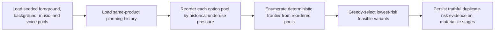
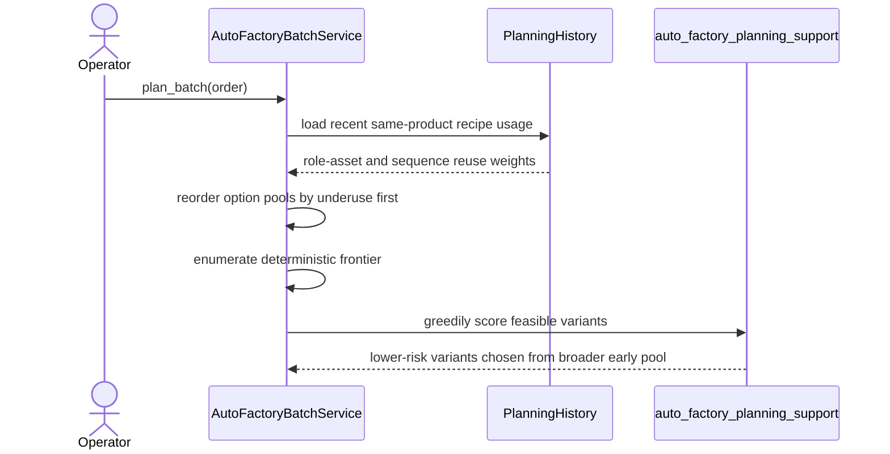

# Auto Factory Frontier Option Pool Diversity Hardening Workflow 2026-06-21

This document is the SSOT for the next Auto Factory anti-duplicate hardening slice that improves which `voice`, `background`, `music`, and `foreground_sequence` options are surfaced early inside the deterministic frontier.

It extends [84_Auto_Factory_Foreground_And_Music_Diversity_Hardening_Workflow_2026-06-21.md](/F:/programming/python/MTClipFactory/doc/84_Auto_Factory_Foreground_And_Music_Diversity_Hardening_Workflow_2026-06-21.md).

## Purpose

- keep the deterministic frontier approach
- improve early candidate quality without pretending the product has more assets than it really has
- surface historically underused assets and sequences earlier inside the frontier so greedy selection can actually choose them

## Live Finding That Triggered This Slice

The live `Biothentic0001` run at `products_20260621_060228_048292` confirmed a real remaining gap:

- the product had `9` ready `background_video` assets and `7` ready `background_music` assets
- the run still concentrated on only `4` backgrounds and `3` music tracks across `10` outputs
- persisted `materialize` evidence still showed repeated `background_asset_reused`, `music_asset_reused`, `voice_asset_overused`, and repeated foreground-role pressure

This means the current frontier is truthful, but its early option ordering still lets a narrow subset dominate when better underused options exist deeper in the pool.

## Core Decision

- keep exact fingerprint blocking as the hard duplicate guard
- keep deterministic seeded ordering as the stable tie-break baseline
- before frontier enumeration, reorder option pools by historical underuse pressure so low-history assets and low-history foreground sequences appear earlier
- preserve truthful reuse evidence when the product really is diversity-limited

## Expected Behavior

When a product has a larger ready pool than one batch can consume:

- underused `background_video` assets should surface before heavily reused ones
- underused `background_music` assets should surface before heavily reused ones
- underused `voiceover` assets should surface before heavily reused ones
- underused `foreground_sequence` candidates should surface before historically repeated sequence families

When multiple options have the same historical pressure:

- the existing seeded deterministic order remains the tie-break path

When every option has already been heavily used:

- the planner must stay truthful, continue using the best available options, and persist the resulting risk evidence

## Workflow

## Sequence

## Truth Boundaries

- this slice improves which candidates are surfaced early; it does not claim platform-level duplicate immunity
- if the product lacks enough genuinely distinct source assets, risk must still stay visible
- this slice does not change the pending truth boundary for backend-functional `Pause/Stop/Resume`

## Acceptance Criteria

- large `background` or `music` pools should not collapse onto only the first few seeded options when lower-history options exist
- deterministic seeded behavior must remain stable for equally weighted options
- pytest must lock the new option-pool ordering behavior and the large-pool planner regression
