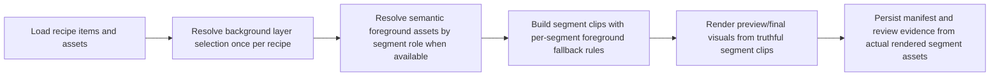
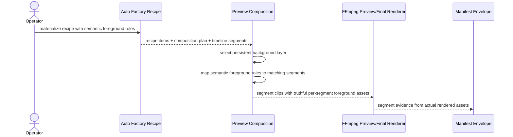

# Auto Factory Segment-Aware Foreground Assignment Rendering Workflow 2026-06-21

This document is the SSOT for the next Auto Factory anti-duplicate correction slice that makes semantic foreground assignments render truthfully per segment instead of collapsing to one foreground asset across the whole recipe.

For operator-grade Auto Factory materialization, this behavior is now superseded by [88_Auto_Factory_Persistent_Foreground_Background_Clip_Policy_2026-06-21.md](/F:/programming/python/MTClipFactory/doc/88_Auto_Factory_Persistent_Foreground_Background_Clip_Policy_2026-06-21.md): Auto Factory now plans one persistent foreground asset plus one persistent background asset per clip, while the semantic per-segment path remains available for explicit/manual recipe flows and backward-safe rendering support.

It extends [85_Auto_Factory_Frontier_Option_Pool_Diversity_Hardening_Workflow_2026-06-21.md](/F:/programming/python/MTClipFactory/doc/85_Auto_Factory_Frontier_Option_Pool_Diversity_Hardening_Workflow_2026-06-21.md).

## Purpose

- align rendered clip behavior with the planner's semantic `hook` / `problem` / `benefit` / `proof` / `cta` foreground assignments
- make Auto Factory foreground-sequence diversity real in preview/final outputs instead of mostly theoretical recipe metadata
- preserve backward-safe behavior for older manually built recipes that use non-semantic foreground role names

## Live Finding That Triggered This Slice

The live `Biothentic0001` investigation showed a deeper truth gap:

- Auto Factory materialized different foreground assets for semantic roles in one recipe
- preview rendering still selected one persistent `product_focus_visual` asset and reused it across all segments
- this meant planner-side foreground-sequence diversity was not fully reflected in the rendered clip

## Core Decision

- keep persistent recipe-wide selection for `background_visual`
- keep backward-safe fallback for non-semantic manual foreground roles
- when a recipe contains semantic foreground roles matching real segment types, render those foreground assets on the corresponding segments
- fall back to the existing persistent foreground selection only when no semantic per-segment foreground exists

## Expected Behavior

When the recipe contains semantic foreground assignments such as `hook`, `problem`, `benefit`, `proof`, or `cta`:

- the matching segment should render that assigned foreground asset
- manifests and visual-composite evidence should show the actual per-segment foreground asset codes
- review-gate distinct-visual checks should now see the real primary visual diversity

When the recipe uses older manual foreground role names such as `hero_a` or `hero_b`:

- the existing persistent `product_focus_visual` behavior stays valid

## Workflow

## Sequence

## Truth Boundaries

- this slice corrects MTClipFactory's own render truth; it does not claim external platform duplicate immunity
- this slice does not remove the need for more source assets when the product is genuinely diversity-limited
- this slice does not change the pending backend truth boundary for worker-lease-based `Pause/Stop/Resume`

## Acceptance Criteria

- semantic foreground role assignments must render on the matching segment types
- non-semantic manual foreground roles must keep the existing persistent fallback behavior
- manifest and visual composite summaries must reflect the actual per-segment foreground assets
- pytest must lock the new segment-aware foreground behavior plus the backward-safe fallback path
