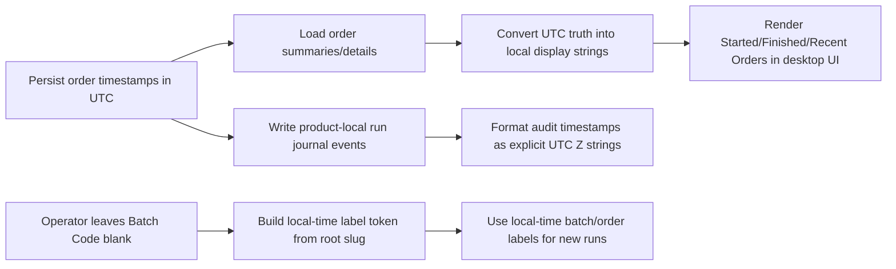
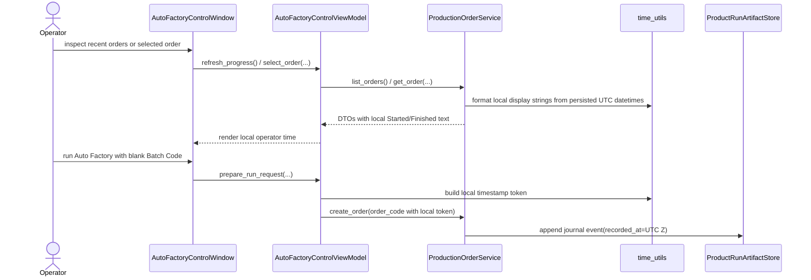

# Auto Factory Local Time Truth 2026-06-21

This document is the SSOT for operator-visible time truth in the desktop `Auto Factory` workflow.

It extends [70_Auto_Factory_Live_Progress_And_Control_Groundwork_2026-06-20.md](/F:/programming/python/MTClipFactory/doc/70_Auto_Factory_Live_Progress_And_Control_Groundwork_2026-06-20.md), [71_Auto_Factory_Persisted_Run_Control_Local_Worker_Baseline_2026-06-20.md](/F:/programming/python/MTClipFactory/doc/71_Auto_Factory_Persisted_Run_Control_Local_Worker_Baseline_2026-06-20.md), and [76_Auto_Factory_Default_Batch_Code_Traceability_Workflow_2026-06-21.md](/F:/programming/python/MTClipFactory/doc/76_Auto_Factory_Default_Batch_Code_Traceability_Workflow_2026-06-21.md).

## Purpose

- stop operator confusion when persisted UTC timestamps are shown as if they were local wall-clock time
- keep persisted database truth stable while making desktop order monitoring readable in the operator's current locale
- make product-local run artifacts explicit about timezone so run journals remain auditable

## Problem Statement

The control-plane baseline already persisted order, stage, and event times safely in UTC-shaped naive datetimes.

That persistence choice was acceptable internally, but one operator-grade gap remained:

1. the desktop `Auto Factory` screen formatted persisted timestamps directly without converting them to local display time
2. auto-generated `batch_code` and `order_code` timestamps also used UTC-shaped wall-clock tokens, which made recent run labels look several hours behind the operator session
3. product-local run journals mixed explicit `...Z` timestamps with timezone-less `YYYY-MM-DD HH:MM:SS` strings, which looked like local time even when they were UTC

## Core Decision

- keep persisted database datetime truth in UTC
- convert persisted order summary/detail timestamps into local operator display time before they reach the desktop `Auto Factory` screen
- generate new automatic `batch_code` and derived `order_code` timestamp tokens in local operator time so fresh run labels align with the visible desktop session
- keep journal and other audit-artifact event timestamps timezone-explicit in UTC `Z` form

## Workflow

## Sequence

## Truth Boundaries

- persisted order, stage, and event datetimes remain UTC-backed control-plane truth
- desktop Auto Factory surfaces now show local operator time for order-level timestamp strings
- automatic batch/order labels are operator-readable local-time identifiers, not authoritative audit timestamps
- journal and other artifact timestamps must stay explicit about timezone whenever they leave the database seam

## Acceptance Criteria

- a production order started at `2026-06-21 07:57:27` UTC displays as `2026-06-21 14:57:27` for an operator in `UTC+07:00`
- recent-order `Started` and `Finished` columns use the same local display basis as selected-order details
- blank `Batch Code` auto-generation no longer creates new operator-visible labels that look hours behind the current session
- product-local journal timestamps use timezone-explicit UTC `Z` formatting consistently instead of mixing UTC with ambiguous timezone-less strings
- pytest covers both local order-time display conversion and explicit UTC journal-event formatting
