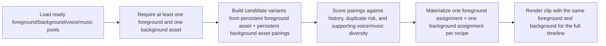
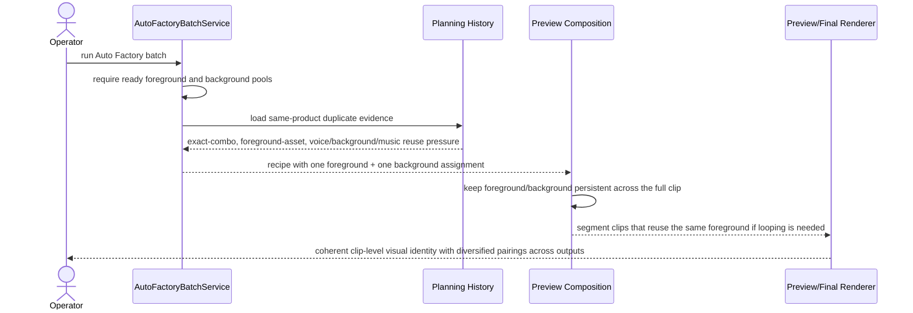

# Auto Factory Persistent Foreground Background Clip Policy 2026-06-21

This document is the SSOT for the operator-grade Auto Factory clip-assembly policy that keeps each generated clip on exactly one persistent foreground video plus one persistent background video.

It extends [85_Auto_Factory_Frontier_Option_Pool_Diversity_Hardening_Workflow_2026-06-21.md](/F:/programming/python/MTClipFactory/doc/85_Auto_Factory_Frontier_Option_Pool_Diversity_Hardening_Workflow_2026-06-21.md), [86_Auto_Factory_Segment_Aware_Foreground_Assignment_Rendering_Workflow_2026-06-21.md](/F:/programming/python/MTClipFactory/doc/86_Auto_Factory_Segment_Aware_Foreground_Assignment_Rendering_Workflow_2026-06-21.md), and [63_Auto_Factory_Operations_Control_Requirements_2026-06-19.md](/F:/programming/python/MTClipFactory/doc/63_Auto_Factory_Operations_Control_Requirements_2026-06-19.md).

## Purpose

- keep Auto Factory clips closer to short-form ad publishing expectations where one presenter-led visual stays coherent for the whole clip
- reduce duplicate-content risk by varying clip-level foreground/background pairings across outputs instead of swapping foreground mid-clip
- keep operator truth simple: one clip must have one ready `foreground_video` and one ready `background_video`

## Live Finding That Triggered This Slice

The live anti-duplicate investigation exposed one operator-facing mismatch:

1. segment-aware semantic foreground switching can increase internal diversity, but it can also make one short ad feel visually inconsistent
2. platform duplicate risk is not improved just by switching foreground roles inside one clip when the same clip-level visual identity still repeats across outputs
3. the operator goal for Auto Factory is not semantic role showcase inside one clip; it is commercially varied clip formulas across many outputs

## Core Decision

- Auto Factory materialized recipes must use exactly one persistent `foreground_video` asset per clip
- Auto Factory materialized recipes must use exactly one persistent `background_video` asset per clip
- the foreground asset must not switch mid-clip
- if the foreground asset is shorter than one or more timeline segments, fill policy should loop that same foreground asset instead of switching to another foreground asset
- folder-driven Auto Factory runs must treat missing `foreground` or missing `background` asset folders as a real planning shortfall
- semantic foreground role rendering remains available for older/manual recipe flows, but it is no longer the default Auto Factory operator-grade materialization policy

## Expected Behavior

When Auto Factory plans a batch:

- each planned recipe should contain one `background` assignment and one `foreground` assignment
- near-duplicate scoring should treat repeated foreground reuse as repeated clip-level foreground-asset reuse
- planner history may still use an internal repeated `foreground_sequence` signature, but that signature now represents one persistent foreground asset repeated across semantic slots for scoring compatibility

When Auto Factory renders a planned recipe:

- the same foreground asset stays active for the whole clip
- the same background asset stays active for the whole clip
- no semantic role should cause a foreground swap mid-clip for Auto Factory materialized recipes
- if foreground duration is short, the renderer should loop the same foreground asset to the segment instead of freezing a stale frame by default

## Workflow

## Sequence

## Truth Boundaries

- this policy reduces MTClipFactory-side duplicate risk; it does not guarantee `100%` immunity from platform duplicate detection
- this policy does not invent diversity when the product has too few distinct foreground or background assets
- `Pause Run`, `Stop Run`, and `Resume Run` truth boundaries remain unchanged and still depend on persisted safe-checkpoint plus worker-lease behavior

## Acceptance Criteria

- Auto Factory planned recipes contain exactly one `foreground` assignment and one `background` assignment per clip
- Auto Factory clips never switch foreground mid-clip
- default foreground fill policy loops the same foreground asset when needed instead of switching assets
- Auto Factory reports truthful shortfall when foreground or background assets are missing
- pytest locks planner, folder-intake, and production-order behavior for the persistent foreground/background policy
