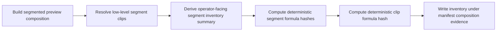
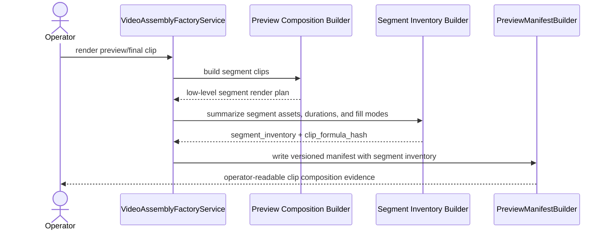

# Auto Factory Segment Inventory Manifest Workflow 2026-06-21

This document is the SSOT for the next Auto Factory audit and anti-duplicate support slice that adds explicit clip-level segment inventory evidence to preview/final manifests.

It extends [58_Versioned_Manifest_Envelope_Workflow_2026-06-15.md](/F:/programming/python/MTClipFactory/doc/58_Versioned_Manifest_Envelope_Workflow_2026-06-15.md), [78_Auto_Factory_Near_Duplicate_Similarity_Workflow_2026-06-21.md](/F:/programming/python/MTClipFactory/doc/78_Auto_Factory_Near_Duplicate_Similarity_Workflow_2026-06-21.md), and [88_Auto_Factory_Persistent_Foreground_Background_Clip_Policy_2026-06-21.md](/F:/programming/python/MTClipFactory/doc/88_Auto_Factory_Persistent_Foreground_Background_Clip_Policy_2026-06-21.md).

## Purpose

- make every rendered clip explainable in operator terms: which segments exist, which assets they use, and how long each one lasts
- create one stable manifest seam for future duplicate hardening beyond planner-only recipe fingerprints
- keep Auto Factory truthful to the persistent-foreground-plus-persistent-background clip policy while still exposing timeline structure

## Problem Statement

Current manifests already expose `segments`, but they are still closer to render plumbing than operator audit truth.

Important gaps remain:

1. operators cannot quickly see one clip-level segment summary such as distinct primary/background asset counts or one clip formula hash
2. future duplicate hardening has no manifest-native segment-formula seam to compare clips at the timeline-structure level
3. PM/operator review has to reconstruct the clip mentally from scattered `segments`, `visual_composite`, and caption sections

## Core Decision

- keep the existing `segments` list as the low-level render trace
- add one explicit `segment_inventory` section under manifest `composition`
- keep one backward-safe legacy top-level alias for `segment_inventory`, like other manifest sections already do
- each inventory segment should record:
  - timing
  - primary visual asset
  - optional background visual asset
  - fill modes
  - source durations
  - caption-role presence
  - one deterministic segment formula hash
- each clip should also expose one deterministic clip formula hash derived from the ordered segment formulas

## Expected Behavior

When preview or final render completes:

- the manifest must expose a clip-level `segment_inventory`
- operators must be able to answer:
  - how many segments are in this clip
  - which foreground/background assets appear in those segments
  - whether the clip reused one persistent foreground across all segments
  - how much time each segment occupies
- future tooling must be able to compare clip formulas without reparsing the entire render evidence payload

## Workflow

## Sequence

## Truth Boundaries

- this slice adds audit truth; it does not by itself change planner selection policy
- this slice does not claim platform-native duplicate detection
- clip formula hashes are internal MTClipFactory evidence and should not be described as external platform-safe uniqueness keys
- the persistent-foreground-plus-persistent-background Auto Factory policy remains unchanged

## Acceptance Criteria

- preview/final manifests expose `composition.segment_inventory`
- the same manifest also keeps one backward-safe top-level `segment_inventory` alias
- each segment inventory entry records primary/background asset identity, timing, fill modes, and source durations
- each clip inventory exposes distinct-asset counts plus one deterministic clip formula hash
- pytest locks the new manifest shape and any UI/helper surfaces that summarize it
