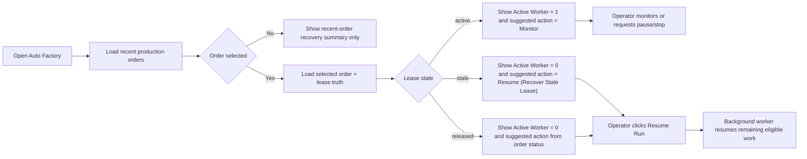
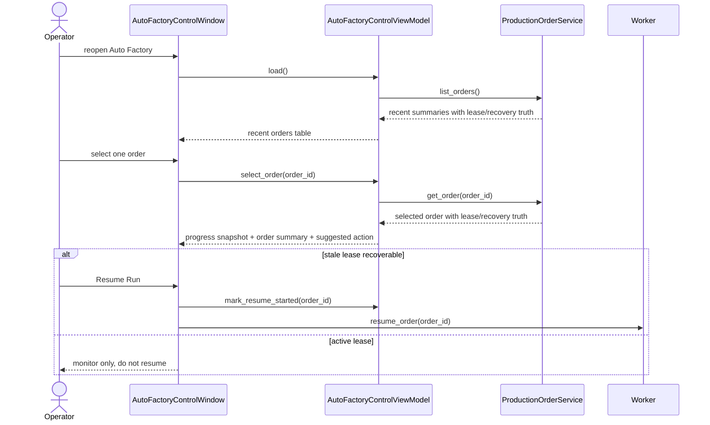

# Auto Factory Reopen And Continue Recovery Surface 2026-06-25

This document is the SSOT for the first operator-facing recovery-truth surface on top of the local-worker `Production Order` lease baseline.

It extends [63_Auto_Factory_Operations_Control_Requirements_2026-06-19.md](/F:/programming/python/MTClipFactory/doc/63_Auto_Factory_Operations_Control_Requirements_2026-06-19.md), [69_Auto_Factory_Tabbed_Workspace_Layout_2026-06-20.md](/F:/programming/python/MTClipFactory/doc/69_Auto_Factory_Tabbed_Workspace_Layout_2026-06-20.md), [70_Auto_Factory_Live_Progress_And_Control_Groundwork_2026-06-20.md](/F:/programming/python/MTClipFactory/doc/70_Auto_Factory_Live_Progress_And_Control_Groundwork_2026-06-20.md), and [71_Auto_Factory_Persisted_Run_Control_Local_Worker_Baseline_2026-06-20.md](/F:/programming/python/MTClipFactory/doc/71_Auto_Factory_Persisted_Run_Control_Local_Worker_Baseline_2026-06-20.md).

## Purpose

- let operators reopen the app and tell the difference between an actively leased run and a stale-but-recoverable run
- stop the UI from implying that a stale lease still has one active worker
- expose one concise recovery recommendation in both recent-order history and selected-order detail surfaces

## Problem Statement

The persisted order model already carries `lease_owner`, `lease_heartbeat_at`, and `lease_expires_at`, and backend resume can recover stale leases. But the operator-facing surface still has one truth gap:

1. an order can look like it still has one active worker even after the lease has expired
2. recent-order history does not summarize whether the next operator action should be `Monitor`, `Resume`, or `Resume (Recover Stale Lease)`
3. selected-order guidance does not explain recovery state directly enough during reopen-and-continue workflows

## Core Decision

- lease state must be derived from persisted expiration truth, not only from the presence of `lease_owner`
- the UI should expose one operator-readable `recovery_state` plus one `suggested_action`
- `Resume Run` remains the single operator action for paused, stopped, retryable, review-required, blocked, or stale-leased orders

## Recovery State Vocabulary

- `active`: lease owner exists and lease is not stale
- `stale`: lease owner exists but lease expiration has passed
- `released`: no lease owner is currently attached
- `not_applicable`: order state does not use lease recovery semantics in practice

## Suggested Action Vocabulary

- `monitor`: order is actively leased and should be watched, not resumed
- `resume`: order is eligible to continue from persisted state
- `resume_recover_stale`: order should be resumed specifically to recover an expired lease
- `inspect`: order is complete or does not currently need a recovery action

## Workflow

## Sequence

## UI Rules

- `Recent Production Orders` should surface `Recovery State` and `Suggested Action`
- `Run Progress` and selected-order summary should show `Lease State`
- `Active Workers` must become `0` when the persisted lease is stale, even if `lease_owner` is still recorded
- `Resume Run` may be enabled for stale active-status orders because the action is lease recovery, not duplicate execution
- operator guidance text should explicitly say `Resume Run will recover the stale lease` when that is the current situation

## Acceptance Criteria

- stale leased orders no longer appear to have one active worker
- recent-order history exposes enough recovery truth that operators can spot reopen-and-continue candidates quickly
- selected-order detail and run-progress text explain whether the next step is monitor, resume, or stale-lease recovery
- docs, tests, and UI stay aligned with the persisted backend behavior
