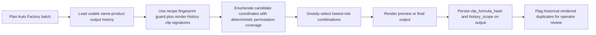
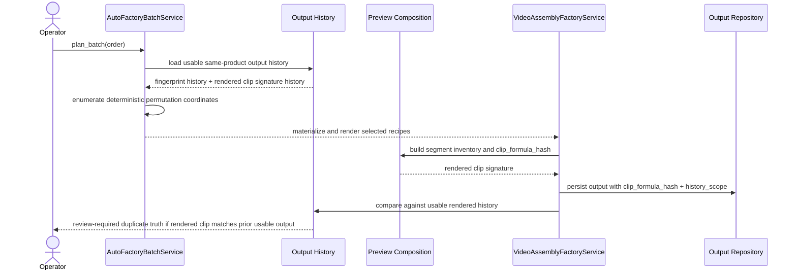

# Auto Factory Rendered History And Permutation Diversity Workflow 2026-06-25

This document is the SSOT for the next Auto Factory anti-duplicate hardening slice that connects render-truth clip signatures to persisted output history and replaces axis-biased frontier coverage with permutation-based candidate coverage.

It extends [80_Auto_Factory_Exact_Fingerprint_Hash_Duplicate_Guard_2026-06-21.md](/F:/programming/python/MTClipFactory/doc/80_Auto_Factory_Exact_Fingerprint_Hash_Duplicate_Guard_2026-06-21.md), [85_Auto_Factory_Frontier_Option_Pool_Diversity_Hardening_Workflow_2026-06-21.md](/F:/programming/python/MTClipFactory/doc/85_Auto_Factory_Frontier_Option_Pool_Diversity_Hardening_Workflow_2026-06-21.md), and [89_Auto_Factory_Segment_Inventory_Manifest_Workflow_2026-06-21.md](/F:/programming/python/MTClipFactory/doc/89_Auto_Factory_Segment_Inventory_Manifest_Workflow_2026-06-21.md).

## Purpose

- promote rendered clip signatures from manifest-only audit evidence into persisted output-history truth
- separate usable automation/publishing history from manual draft/test preview noise
- improve early large-pool candidate coverage so foreground, background, voice, and music diversity is not biased by one axis order

## Live Findings That Triggered This Slice

The latest duplicate-content review exposed three remaining gaps:

1. the planner hard-blocks exact recipe fingerprints, but the richer rendered `clip_formula_hash` is not yet consumed during future duplicate checks
2. manual preview experiments can contaminate same-product duplicate history even when those renders were not meant to represent publishable automation output
3. deterministic frontier scanning still explores the search space with axis-order bias, so larger `background` or `music` pools can remain underused

## Core Decisions

- persist each rendered output's `clip_formula_hash` directly on the output record
- persist one explicit `history_scope` on each output record
- treat `approved` outputs and Auto Factory preview outputs as usable duplicate-history evidence
- treat ad hoc/manual preview outputs without automation source mode as `draft_preview` history so they remain auditable but do not hard-block future Auto Factory planning
- keep `fingerprint_hash` as the pre-render recipe-level guard
- add render-history duplicate detection on top of that recipe-level guard using persisted `clip_formula_hash`
- replace deterministic axis-frontier candidate coverage with deterministic permutation coverage over the full Cartesian coordinate space

## History Scope Policy

- `approved_output`
  - approved output records
  - strongest same-product reuse evidence
- `auto_factory_preview`
  - preview outputs created by Auto Factory / production-order automation source modes
  - counts as usable same-product output history because it represents real generated clip inventory
- `draft_preview`
  - manual or ad hoc preview outputs without automation source mode
  - retained for audit, but excluded from hard duplicate-history blocking

## Expected Behavior

When preview or final render completes:

- the output row must persist the rendered `clip_formula_hash`
- the output row must persist one truthful `history_scope`
- if the rendered `clip_formula_hash` matches existing usable same-product output history, the render must be surfaced as duplicate-risk history and require review instead of looking clean

When Auto Factory plans a batch:

- manual draft previews must not silently exhaust the same-product exact-repeat pool
- usable Auto Factory history must still block or penalize repeated clip formulas truthfully
- larger multi-axis asset pools must be sampled through deterministic permutation coverage instead of axis-biased breadth-first frontier growth

## Workflow

## Sequence

## Truth Boundaries

- this slice improves MTClipFactory duplicate protection; it does not claim `100%` immunity from external platform duplicate detection
- `clip_formula_hash` remains an internal rendered-history signature, not a platform-native moderation key
- `draft_preview` outputs stay visible for audit but are intentionally excluded from hard Auto Factory history blocking
- pause/stop/resume backend truth boundaries remain unchanged

## Acceptance Criteria

- output records persist `clip_formula_hash` and `history_scope`
- Auto Factory planning excludes `draft_preview` output history from hard same-product exact-repeat blocking
- usable rendered-history duplicate matches force review-visible duplicate truth
- candidate coverage across larger foreground/background/voice/music pools is deterministic but no longer biased by one fixed frontier axis order
- pytest locks output-history persistence, draft-vs-usable history filtering, rendered duplicate review signaling, and permutation-based diversity coverage
