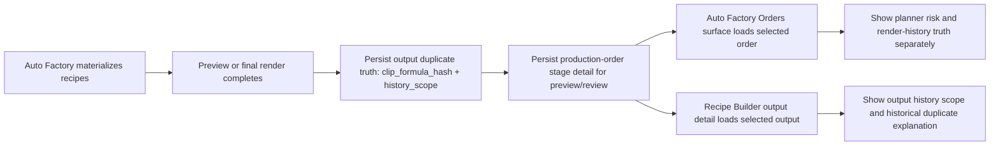
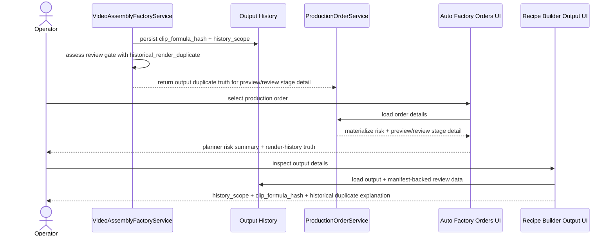

# Auto Factory Render History Operator Surface And Render Service Split 2026-06-26

This document is the SSOT for the next operator-facing Auto Factory truth slice after rendered-history persistence was delivered in [91_Auto_Factory_Rendered_History_And_Permutation_Diversity_Workflow_2026-06-25.md](/F:/programming/python/MTClipFactory/doc/91_Auto_Factory_Rendered_History_And_Permutation_Diversity_Workflow_2026-06-25.md).

It also records the implementation seam for splitting the recipe preview/final render orchestration out of the oversized factory service module so the codebase remains testable and reviewable under the repo line-count guardrail.

## Purpose

- surface persisted render-history truth more directly for operators in Auto Factory and Recipe Builder
- keep duplicate-risk messaging aligned with what is actually persisted on outputs and production-order stages
- reduce `src/mt_clip_factory/factory/services.py` below the repo `800`-line preference by extracting render-orchestration support

## Live Findings That Triggered This Slice

Recent operator checks exposed two gaps that remained after the duplicate-hardening backend work:

1. persisted `clip_formula_hash`, `history_scope`, and rendered-history duplicate signals existed, but the main operator surfaces still emphasized only planner-time `materialize` risk
2. `src/mt_clip_factory/factory/services.py` had grown beyond the repo line-count guardrail, making further operator-grade hardening riskier to review and maintain

## Core Decisions

- the Auto Factory `Orders` summary must distinguish planner-time risk from render-history truth
- preview/review stage detail must surface `history_scope`, rendered `clip_formula_hash`, and historical-render-duplicate explanations when that evidence exists
- Recipe Builder output details must expose `history_scope` alongside existing output/manifest duplicate evidence
- historical duplicate messaging remains an internal MTClipFactory signal, not a claim about platform moderation certainty
- preview/final render orchestration may be extracted into a support module, but public service behavior and tests must remain unchanged

## Expected Operator Behavior

When an operator selects a production order in Auto Factory:

- the order summary must still show planner-time duplicate-risk evidence from `materialize`
- the same summary must also show whether later preview/review stages recorded usable render-history evidence
- stage rows must explain whether elevated duplicate risk came from planner history, render-history duplication, or both

When an operator inspects one output in Recipe Builder:

- the detail panel must show the output `history_scope`
- the detail panel must keep surfacing `clip_formula_hash` and review-gate evidence from the manifest
- a historical-render-duplicate signal must be explained in operator-friendly language instead of looking like an unnamed raw metric

## Workflow

## Sequence

## Truth Boundaries

- planner-time risk and rendered-history duplicate truth are related but not identical; the UI must not collapse them into one claim
- `history_scope = draft_preview` remains auditable but weaker than usable automation or approved-output history
- a historical render duplicate remains an internal review signal, not proof that Shopee, TikTok, or another platform will definitely flag the clip
- `Pause Run`, `Stop Run`, and `Resume Run` truth boundaries remain unchanged; backend-safe checkpoint semantics are still the pending requirement

## Acceptance Criteria

- Auto Factory selected-order summary distinguishes planner risk from render-history truth
- Auto Factory stage rows expose persisted `history_scope` and rendered-history duplicate explanations when available
- Recipe Builder output detail shows `history_scope` and clearer historical duplicate messaging
- `src/mt_clip_factory/factory/services.py` returns below the repo line-count preference by moving render-orchestration support out of the main service module
- pytest locks the new operator-visible text surfaces and verifies the extracted render-support seam without behavior regression
