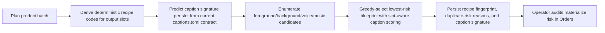
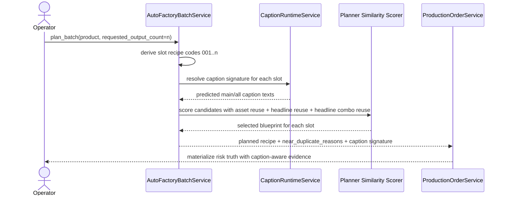

# Auto Factory Caption Aware Same Batch Diversity Workflow 2026-06-26

This document is the SSOT for the next Auto Factory anti-duplicate hardening slice after the live `Biothentic0001` diversity audit recorded in [93_Biothentic0001_Live_Auto_Factory_Diversity_Audit_2026-06-26.md](/F:/programming/python/MTClipFactory/doc/93_Biothentic0001_Live_Auto_Factory_Diversity_Audit_2026-06-26.md).

It extends [91_Auto_Factory_Rendered_History_And_Permutation_Diversity_Workflow_2026-06-25.md](/F:/programming/python/MTClipFactory/doc/91_Auto_Factory_Rendered_History_And_Permutation_Diversity_Workflow_2026-06-25.md) and [92_Auto_Factory_Render_History_Operator_Surface_And_Render_Service_Split_2026-06-26.md](/F:/programming/python/MTClipFactory/doc/92_Auto_Factory_Render_History_Operator_Surface_And_Render_Service_Split_2026-06-26.md).

## Purpose

- make the Auto Factory planner aware of the deterministic caption/headline text that each output slot will receive before recipes are materialized
- reduce same-batch duplicate feel when a small headline pool rotates across a larger output request
- keep duplicate-risk reasons truthful by distinguishing caption reuse pressure from visual/audio asset reuse pressure

## Live Findings That Triggered This Slice

The latest `Biothentic0001` live audit showed that:

1. rendered `clip_formula_hash` values were unique across the full 10-output batch
2. persistent `foreground + background` pairing was already much healthier than before
3. the strongest remaining same-batch sameness signal came from a small rotating headline pool, not only from exact render-history duplication

In practice, this means a batch can avoid exact duplicate history while still looking commercially repetitive because the same hooks keep landing on similar presenter/background/music combinations.

## Core Decisions

- the planner must predict caption selection using the current caption contract plus the deterministic batch recipe code for each output slot
- the planner must score headline reuse inside the same batch even before any preview render exists
- the planner must penalize repeated `headline + foreground` combinations more strongly than headline reuse alone
- the planner may also penalize repeated `headline + music` combinations because repeated copy cadence over repeated music can still feel samey to human review
- planner-side caption-aware scoring is same-batch only in this slice; it must not pretend to reconstruct historical caption truth across older runs that may have used different caption contracts

## Expected Behavior

When Auto Factory plans `n` outputs for one product:

- the planner predicts which caption/headline text each output slot will receive under the current `captions.toml` contract
- if the caption pool rotates, later outputs should prefer asset pairings that avoid reusing the same headline with the same foreground whenever fresh pairings still exist
- persisted planner reasons should now be able to say that risk rose because the headline repeated, not only because foreground/background/music repeated
- production-order `materialize` detail should retain the predicted caption signature for audit

## Workflow

## Sequence

## Truth Boundaries

- this slice improves same-batch duplicate-feel resistance; it does not claim immunity from Shopee, TikTok, or any other platform duplicate detection
- caption-aware scoring is based on the current caption contract and deterministic slot selection, not on vision-model similarity of rendered pixels
- historical caption truth is intentionally out of scope here because older rendered outputs may have been produced under different caption contracts
- exact render-history duplicate checks and `clip_formula_hash` review signals remain the stronger post-render truth seam
- `Pause Run`, `Stop Run`, and `Resume Run` backend truth boundaries remain unchanged

## Acceptance Criteria

- `CaptionRuntimeService` can resolve a deterministic caption signature without running the full layout/render path
- Auto Factory planning penalizes repeated headline reuse within the same batch
- Auto Factory planning penalizes repeated `headline + foreground` reuse within the same batch when fresh pairings still exist
- planned recipes and persisted `materialize` stage details retain predicted caption-signature evidence for audit
- pytest locks the slot-signature resolver, same-batch headline-combo spreading, and new planner risk reasons
