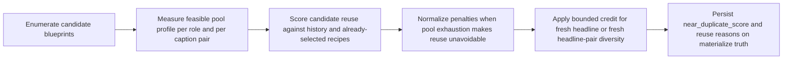
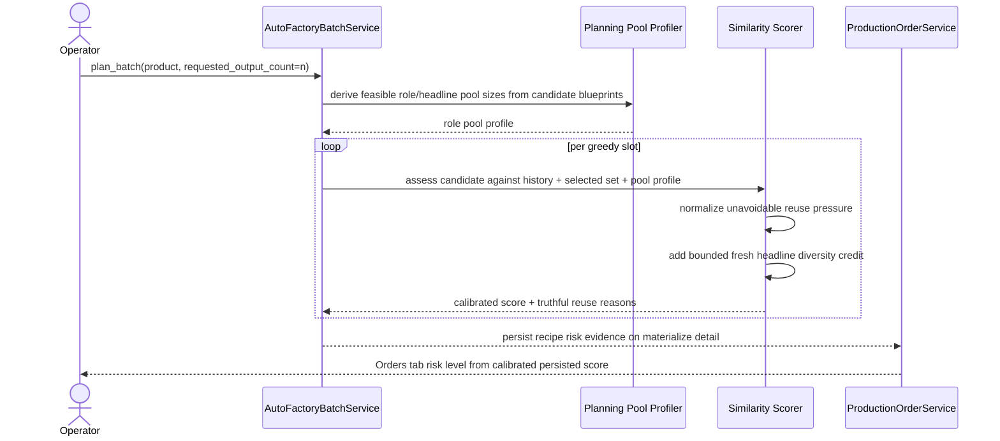

# Auto Factory Pool-Normalized Duplicate Scoring Workflow 2026-06-26

This document is the SSOT for the next anti-duplicate scoring calibration slice after [94_Auto_Factory_Caption_Aware_Same_Batch_Diversity_Workflow_2026-06-26.md](/F:/programming/python/MTClipFactory/doc/94_Auto_Factory_Caption_Aware_Same_Batch_Diversity_Workflow_2026-06-26.md) and the live product audit captured in [95_Biothentic0001_Caption_Aware_Planner_Audit_2026-06-26.md](/F:/programming/python/MTClipFactory/doc/95_Biothentic0001_Caption_Aware_Planner_Audit_2026-06-26.md).

## Purpose

- keep Auto Factory duplicate-risk scoring truthful when a product has a small ready asset pool
- stop over-penalizing reuse that becomes mathematically unavoidable once the planner has already consumed the full ready pool
- preserve strong penalties for avoidable reuse while fresh role or headline-pair alternatives still exist
- let fresh same-batch headline diversity reduce risk somewhat without pretending the product has no remaining asset bottlenecks

## Live Trigger

The refreshed `Biothentic0001` headline pool widened same-batch headline diversity, but live planner risk still stayed `High` because the score continued to stack full historical reuse penalties even when the product exposed only:

- `3` ready `foreground_video`
- `9` ready `background_video`
- `1` ready `voiceover`

That behavior was too pessimistic for operator review because:

1. repeated use of one lone voice asset is not avoidable
2. repeated use after all foreground options are already consumed should not be scored the same as early avoidable reuse
3. fresh `headline + foreground` or `headline + music` pairings should receive bounded credit instead of only avoiding extra penalties

## Core Decisions

- the planner must derive a role-pool profile from the currently feasible candidate blueprints before greedy selection starts
- role reuse penalties must distinguish between:
  - avoidable reuse while unused pool capacity still exists
  - constrained reuse after the pool is already exhausted evenly
- same-batch persistent foreground coverage should later be free to harden further without changing the exact-history guard, especially when one foreground remains unused while another is already repeating
- headline reuse penalties must also respect the available deterministic same-batch headline pool
- fresh same-batch headline signals may apply a bounded diversity credit, but exact-combo reuse must still stay hard-blocked at the stronger exact-history seam
- risk reasons remain reuse-oriented and truthful; this slice calibrates score math without claiming that constrained products are duplicate-safe

## Workflow

## Sequence

## Expected Behavior

- early reuse while fresh role alternatives still exist remains strongly penalized
- same-batch foreground selection should prefer fresh persistent foreground coverage before repeating another foreground that is already used in the batch
- once the planner has already consumed the full ready pool evenly, unavoidable reuse stays visible but scores lower than avoidable reuse
- one-voice products can still show voice reuse reasons, but that constraint no longer dominates the whole order into `High` by itself
- fresh deterministic headlines and fresh `headline + foreground` / `headline + music` pairings can lower the score modestly
- exact fingerprint reuse remains blocked separately by the canonical `fingerprint_hash` guard

## Acceptance Criteria

- planner scoring derives role-pool and headline-pool capacity from feasible candidates before greedy selection
- planner risk remains higher for avoidable reuse than for mathematically unavoidable pool exhaustion
- bounded same-batch diversity credit lowers score for fresh headline pairings without suppressing exact duplicate guards
- pytest locks both the reuse normalization math and one end-to-end planning case with small-but-evenly-used pools
- docs and live audit reflect the new calibrated operator truth

## Truth Boundaries

- this slice calibrates planner risk; it does not claim immunity from Shopee, TikTok, or any other platform duplicate detection
- a low or medium planner score does not mean the product has a large enough real asset pool for unlimited safe publishing
- the score can now say "this reuse was constrained and spread as fairly as possible", but it still cannot prove rendered pixel-level uniqueness
- backend-functional `Pause Run`, `Stop Run`, and `Resume Run` semantics remain unchanged by this duplicate-scoring slice and are already delivered separately through the local-worker persisted control baseline in document `71`
- later same-batch foreground-coverage pressure can still refine this slice further without changing its core pool-normalized scoring direction
