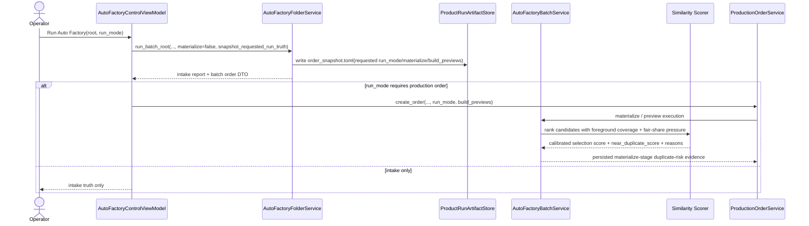

# Auto Factory Requested Run Snapshot And Foreground Balance Workflow 2026-06-27

This document is the SSOT for the next operator-truth and same-batch diversity hardening slice after [47_Product_Local_Run_Artifacts_And_Fill_Policy_Workflow_2026-06-14.md](/F:/programming/python/MTClipFactory/doc/47_Product_Local_Run_Artifacts_And_Fill_Policy_Workflow_2026-06-14.md), [96_Auto_Factory_Pool_Normalized_Duplicate_Scoring_Workflow_2026-06-26.md](/F:/programming/python/MTClipFactory/doc/96_Auto_Factory_Pool_Normalized_Duplicate_Scoring_Workflow_2026-06-26.md), and the live follow-up inspection on production order `#22`.

## Purpose

- keep `order_snapshot.toml` truthful to the operator-requested run mode even when the desktop UI executes intake first and starts the persisted production order afterward
- stop the planner from reusing one `foreground_video` too early inside the same batch when another feasible foreground is still unused
- preserve history-aware anti-duplicate pressure while making same-batch foreground coverage and fair-share balance more explicit
- keep operator-visible duplicate-risk evidence aligned with the actual clip-assembly strategy that the planner is choosing

## Live Trigger

Production order `#22` showed that the latest diversity hardening improved rendered preview outcomes, but two truth gaps remained:

1. `order_snapshot.toml` under the product-local run folder still recorded `materialize_requested = false` and `build_previews_requested = false` even though the operator launched `Intake + Materialize + Build Previews` from the desktop `Auto Factory` screen.
2. planner risk for the same order still showed `Medium` because some persistent foreground reuse happened earlier than necessary inside the batch, even though preview duplicate review later cleared the rendered clips at `duplicate_risk = 0.0`.

## Core Decisions

- product-local `order_snapshot.toml` is an operator-request snapshot, not merely a trace of the folder-intake substep
- the desktop control surface must pass requested run intent into the folder-intake seam when it writes product-local run artifacts before the persisted production order exists
- snapshot truth must include the requested `run_mode` plus the requested materialize/build-preview booleans for that run
- same-batch foreground selection must prefer fresh foreground coverage before repeating a foreground that is already used in the current batch when another feasible foreground remains unused
- after all feasible foregrounds are already represented, the planner should still prefer fair-share balancing instead of letting one foreground get too far ahead of the others without reason
- history-aware reuse pressure remains in place; this slice changes foreground same-batch coverage priority, not the exact-history guard

## Workflow

```mermaid
flowchart LR
    A["Operator chooses Auto Factory run mode"] --> B["ViewModel resolves requested run truth"]
    B --> C["Folder intake executes first"]
    C --> D["order_snapshot.toml stores requested run_mode + requested booleans"]
    D --> E["Persisted production order starts in background worker if requested"]
    E --> F["Planner evaluates candidate blueprints"]
    F --> G["Prefer unused foreground coverage while feasible"]
    G --> H["Prefer fair-share foreground balance after pool coverage is exhausted"]
    H --> I["Persist near_duplicate_score + reasons on materialize truth"]
```

## Sequence

## Acceptance Criteria

- `order_snapshot.toml` records the operator-requested `run_mode` and requested materialize/build-preview booleans even when the UI uses a folder-intake-first execution path
- direct folder-service runs that really materialize/build previews still keep truthful snapshot values without extra caller bookkeeping
- the planner uses every feasible foreground at least once before repeating another foreground when fresh same-batch alternatives still exist
- once all feasible foregrounds are already represented, later selections stay closer to fair-share balance instead of allowing unnecessary foreground skew
- pytest covers both requested-run snapshot truth and one history-aware same-batch foreground-balance case
- operator-visible `Orders` risk evidence remains persisted and machine-readable

## Truth Boundaries

- this slice improves operator truth and same-batch foreground fairness; it does not guarantee immunity from Shopee, TikTok, or any other platform duplicate detection
- if a product has too few real foreground assets, the planner may still need to reuse them; the slice only reduces avoidable early reuse
- rendered preview duplicate review and planner-side near-duplicate scoring remain different seams with different purposes
