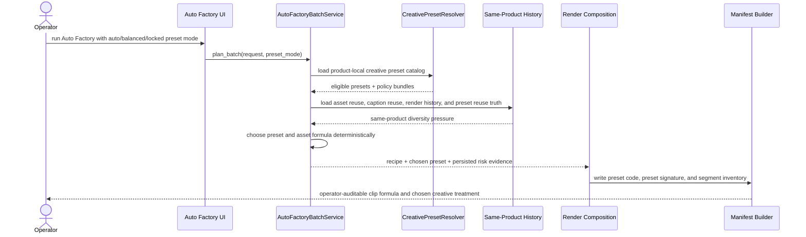

# Auto Factory Creative Preset Orchestration Workflow 2026-06-27

This document is the SSOT for the next Auto Factory creative-diversity slice that introduces operator-auditable clip presets for richer short-form ad variation without abandoning the current anti-duplicate guardrails.

It extends [88_Auto_Factory_Persistent_Foreground_Background_Clip_Policy_2026-06-21.md](/F:/programming/python/MTClipFactory/doc/88_Auto_Factory_Persistent_Foreground_Background_Clip_Policy_2026-06-21.md), [89_Auto_Factory_Segment_Inventory_Manifest_Workflow_2026-06-21.md](/F:/programming/python/MTClipFactory/doc/89_Auto_Factory_Segment_Inventory_Manifest_Workflow_2026-06-21.md), [91_Auto_Factory_Rendered_History_And_Permutation_Diversity_Workflow_2026-06-25.md](/F:/programming/python/MTClipFactory/doc/91_Auto_Factory_Rendered_History_And_Permutation_Diversity_Workflow_2026-06-25.md), [94_Auto_Factory_Caption_Aware_Same_Batch_Diversity_Workflow_2026-06-26.md](/F:/programming/python/MTClipFactory/doc/94_Auto_Factory_Caption_Aware_Same_Batch_Diversity_Workflow_2026-06-26.md), and [98_Auto_Factory_Requested_Run_Snapshot_And_Foreground_Balance_Workflow_2026-06-27.md](/F:/programming/python/MTClipFactory/doc/98_Auto_Factory_Requested_Run_Snapshot_And_Foreground_Balance_Workflow_2026-06-27.md).

## Purpose

- give Auto Factory a higher-level creative language than raw asset permutation alone
- let the system choose or randomize between distinct ad styles while still staying deterministic, testable, and auditable
- reduce commercially repetitive output by varying the clip formula, not only the individual asset ids
- keep operator truth explicit: every generated clip should be explainable by one chosen preset, one asset formula, one caption formula, and one persisted risk summary

## Delivered Baseline Status

- `Phase 1` is delivered on the 2026-06-27 baseline:
  - product-local `creative_presets.toml` parsing and validation
  - audit visibility for creative-preset contract summaries
  - runtime metadata sync for creative preset contracts
- `Phase 2` is delivered on the same baseline:
  - planner-time preset resolution from product-local runtime metadata
  - persisted preset request truth on production-order items
  - persisted chosen preset evidence on materialize stages
- `Phase 3` is delivered as a baseline:
  - Auto Factory UI now exposes preset mode selection plus optional preset-code overrides
  - folder-driven requested-run snapshots persist creative preset request truth
- `Phase 4` is partially delivered:
  - preview/final manifest payloads now carry chosen creative preset evidence when materialize-stage truth exists
  - order-level duplicate summary truth now favors the stronger of planner-time materialize risk and preview/review render-history duplicate risk
  - broader live tuning, preset-family balancing, and operator feedback loops still remain open

## Live Findings That Triggered This Slice

Recent live runs improved from `High / 1.000` duplicate-risk outcomes to healthier `Medium` ranges on some orders, but one structural gap remains:

1. the planner is now better at rotating foregrounds, backgrounds, music, voices, and headlines, but it still lacks a first-class concept for different clip archetypes
2. two clips can avoid exact-duplicate formulas and still feel commercially samey because they use the same pacing, same headline shape, same presenter framing, and same CTA style
3. operators need more than one flat pool of assets; they need reusable ad-making strategies such as presenter-heavy, proof-first, product-closeup, urgency-sale, or benefit-stack treatments
4. auditors need to explain why one clip was chosen, not only which foreground/background ids happened to be selected

## Core Decision

- introduce a clip-level `creative preset` concept for Auto Factory planning
- a creative preset describes one ad-treatment family, not one single render template
- the planner must support both:
  - deterministic auto-selection of the most suitable preset for the current product/request
  - weighted randomization among the best eligible presets so batches do not collapse into one style
- the chosen preset must become persisted run truth on planned recipes, materialize-stage evidence, and preview/final manifests
- creative presets must guide asset selection, caption behavior, and segment rhythm, but they must not break the current operator-grade policy of one persistent `foreground_video` plus one persistent `background_video` per Auto Factory clip

## Role Collaboration Model

### Software Engineer

- design the preset contract, parser, planner seam, persistence, and UI hooks
- keep preset resolution deterministic under one explicit seed basis
- expose preset choice, reasons, and risk evidence through persisted order truth and manifests

### Process Engineer

- define the preset lifecycle: author, validate, activate, retire, and audit
- define guardrails for eligibility, fallback, and cooldown behavior
- decide when the planner should force coverage across preset families before repeating one

### Clip / Movie Producer

- define the actual preset families that feel like distinct short-form ad treatments
- specify segment intent, pacing, caption tone, CTA behavior, and acceptable asset combinations
- reject presets that are technically varied but creatively too similar

### Advertising / Presentation Designer

- map presets to visual and copy language such as urgency, trust, demo, comparison, proof, or lifestyle
- group caption and CTA styles into ad-usable bundles instead of one-off line styling tweaks
- ensure presets are platform-aware for Shopee/TikTok commercial use

### Auditor

- verify that preset diversity is visible in persisted evidence instead of only being implied
- verify that one batch spreads across preset families when the product library supports that spread
- verify that duplicate-risk scoring still tells the truth when preset variation is mathematically constrained

## Preset Model

Each preset should be product-local and TOML-native.

Recommended contract direction:

- one new `creative_presets.toml` under the product `contracts/` folder
- one `[presets.<preset_code>]` table per preset
- optional future support for a shared global preset catalog, but product-local truth comes first

Recommended preset fields:

- identity
  - `preset_code`
  - `display_name`
  - `enabled`
  - `selection_weight`
- intent
  - `campaign_goal`
  - `tone_tags`
  - `platforms`
  - `target_ratios`
- asset policy
  - `preferred_foreground_tags`
  - `preferred_background_tags`
  - `preferred_voice_tags`
  - `preferred_music_tags`
  - `forbidden_tag_pairs`
- caption policy
  - `headline_pool_names`
  - `cta_pool_names`
  - `main_style_preset`
  - `sub_style_preset`
  - `caption_density`
- segment policy
  - `segment_profile`
  - `hook_ratio`
  - `proof_ratio`
  - `cta_ratio`
  - `preferred_duration_sec`
- diversity policy
  - `cooldown_outputs`
  - `max_batch_share`
  - `pair_rotation_bias`
  - `force_fresh_background_before_repeat`
  - `force_fresh_headline_before_repeat`

## Preset Examples

Example preset families that should feel meaningfully different:

- `presenter_urgency`
  - presenter-led foreground, fast headline, strong sale CTA, energetic music
- `product_proof`
  - cleaner headline, product/background emphasis, testimonial or fact-led voice tone
- `benefit_stack`
  - tighter caption rotation, medium energy, repeated benefit framing, softer CTA
- `lifestyle_soft_sell`
  - calmer pacing, lighter subtitle density, lower urgency, broader background variety
- `offer_countdown`
  - high urgency, strong top headline treatment, hard CTA, stricter cooldown rules

These are not hardcoded only as design labels; they should drive measurable planning behavior.

## Selection Strategy

The planner should not blindly pick one preset or pure-random across the full catalog.

Recommended selection flow:

1. load eligible preset catalog for the product
2. discard presets that are incompatible with the current request
   - missing required tags
   - incompatible platform
   - incompatible ratio
   - insufficient asset pool
3. compute one suitability score per preset
   - asset coverage fit
   - campaign/request fit
   - current batch diversity pressure
   - historical same-product preset reuse
4. keep the top eligible band, not only the single best preset
5. choose deterministically within that top band using the batch seed plus output ordinal
6. apply per-preset asset-selection rules while still honoring the global duplicate guardrails

Recommended operator modes:

- `auto_best_fit`
  - choose from the top eligible presets using deterministic weighted randomization
- `balanced_cycle`
  - spread outputs across preset families as evenly as feasibility allows
- `locked_preset`
  - operator forces one preset for the run
- `preset_mix`
  - operator picks an allowed subset and lets the planner balance inside it

## Workflow

## Sequence

## Persistence And Audit Direction

Minimum new persisted truth:

- planned recipe:
  - `creative_preset_code`
  - `creative_preset_signature`
  - `creative_preset_reasons`
- production-order materialize stage detail:
  - preset code
  - preset suitability summary
  - preset reuse pressure summary
- preview/final manifest:
  - preset identity
  - preset policy summary
  - resolved asset-role evidence
  - resolved caption/segment evidence
- rendered history:
  - future extension may include `preset_code` in output-level history summaries for operator filtering

## Truth Boundaries

- creative presets reduce MTClipFactory-side sameness risk; they do not guarantee `100%` immunity from platform duplicate detection
- presets must not be presented as a replacement for asset diversity; a weak asset library still constrains the output space
- a preset should shape the clip formula, not hide or override truthful duplicate-risk evidence
- the persistent one-foreground-plus-one-background Auto Factory clip policy remains unchanged unless a later SSOT slice explicitly replaces it

## Recommended Delivery Phases

### Phase 1: Contract And Resolver Baseline

- add `creative_presets.toml`
- parse and validate preset definitions
- expose preset summaries in Auto Factory product review surfaces
- status: delivered on 2026-06-27

### Phase 2: Planner Integration

- add preset eligibility and suitability scoring
- add deterministic top-band preset selection
- persist preset evidence on planned recipes and materialize stages
- status: delivered on 2026-06-27

### Phase 3: Operator Controls

- add preset mode controls to Auto Factory
- support `auto_best_fit`, `balanced_cycle`, `locked_preset`, and `preset_mix`
- surface chosen preset and preset spread in `Orders`
- status: delivered baseline on 2026-06-27

### Phase 4: Audit And Tuning

- add preset spread summaries per order
- add tests and live audits on real campaign products
- tune cooldowns, max-batch-share, and preset-family balancing with real operator feedback
- status: partially delivered on 2026-06-27; live tuning still open

## Acceptance Criteria

- operators can author multiple product-local creative presets in TOML without code edits
- Auto Factory can choose a suitable preset automatically or obey an explicit operator preset mode
- preset choice is deterministic for the same request and seed basis
- preset choice and reasons are visible in persisted order truth and manifests
- preset orchestration increases meaningful clip-family diversity instead of only rotating raw asset ids
- pytest can lock resolver validation, preset eligibility, deterministic selection, persistence, and UI truth surfaces
